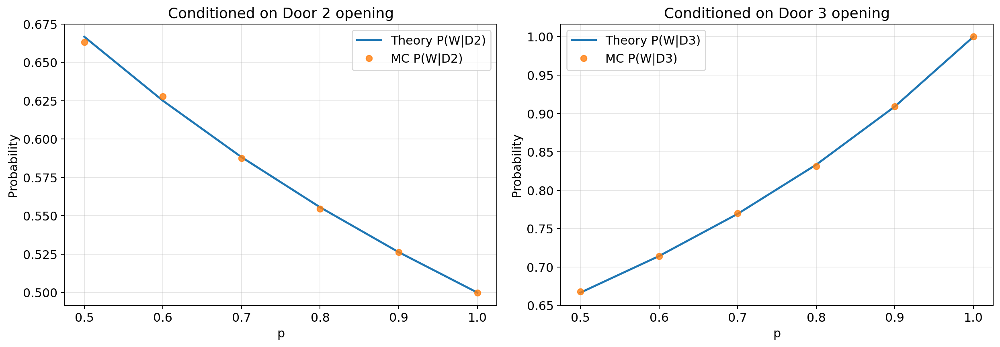

# Diffusion from First Principles - Milestones

This page is the portfolio index for the curriculum. It links the artifacts that are most useful to skim: mini-projects, visual notebooks, and derivation notes with a concrete implementation check.

## Completed Mini-Projects

| Milestone | Artifact | What it shows | What I learned |
| --- | --- | --- | --- |
| Checkpoint 01 - Conditioning in Code | [`mini_projects/checkpoint_01_conditioning_in_code/`](mini_projects/checkpoint_01_conditioning_in_code/) | Bayes' rule and conditioning verified with a biased Monty Hall Monte Carlo simulation. | Conditioning is not just filtering data after the fact. It changes the probability model by using the observed event as evidence. |
| Checkpoint 02 - Toy Score Matching | [`mini_projects/checkpoint_02_toy_score_matching/`](mini_projects/checkpoint_02_toy_score_matching/) | Two training objectives compared against the exact score of a noisy 2D Gaussian mixture. | A shared analytic reference makes objective comparisons meaningful; under the fixed runs, the converted $x_0$ predictor had lower validation score MSE than direct score prediction. |

## Best Current Artifacts

| Artifact | Type | Status | Why it matters |
| --- | --- | --- | --- |
| [`notes/w03_score_of_gaussian.md`](notes/w03_score_of_gaussian.md) + [`notebooks/w03_score_verification_solved.ipynb`](notebooks/w03_score_verification_solved.ipynb) | Derivation + notebook | Complete | Shows that the 1D Gaussian score is a simple pull back toward the mean. |
| [`notes/w04_conditioning_in_diffusion.md`](notes/w04_conditioning_in_diffusion.md) | Diffusion bridge note | Complete | Connects conditioning to denoising intuition before the diffusion-specific machinery appears. |
| [`notebooks/w05_joint_gaussians_solved.ipynb`](notebooks/w05_joint_gaussians_solved.ipynb) | Notebook | Complete | Shows that conditional slices of a joint Gaussian are Gaussian and can be checked empirically. |
| [`notes/w05_2d_gaussian_score.md`](notes/w05_2d_gaussian_score.md) + [`notebooks/w05_2d_gaussian_score_field_solved.ipynb`](notebooks/w05_2d_gaussian_score_field_solved.ipynb) | Derivation + notebook | Complete | Shows that a 2D score is a vector field shaped by the precision matrix. |
| [`notebooks/w06_kl_gaussians_solved.ipynb`](notebooks/w06_kl_gaussians_solved.ipynb) + [`notes/w06_where_kl_appears.md`](notes/w06_where_kl_appears.md) | Notebook + bridge note | Complete | Derives KL for 1D Gaussians, checks empirical estimates, and connects KL to distribution matching in diffusion/flow models. |
| [`notes/w07_conditional_expectation_in_diffusion.md`](notes/w07_conditional_expectation_in_diffusion.md) | Diffusion bridge note | Complete | Connects MSE-optimal denoising and conditional expectation to the Gaussian score identity. |
| [`notebooks/w09_pca_svd_solved.ipynb`](notebooks/w09_pca_svd_solved.ipynb) + [`notes/w09_linear_algebra_in_unets.md`](notes/w09_linear_algebra_in_unets.md) | Notebook + bridge note | Complete | Connects projection, eigendecomposition, SVD, low-rank reconstruction, and nonlinear latent representations. |

## Planned Portfolio Milestones

These are not complete yet. They are the next pieces that should become public-facing mini-projects.

| Planned milestone | Target location | Goal |
| --- | --- | --- |
| DDPM from scratch | `mini_projects/ddpm_baseline_mnist/` | Build and sample from a minimal DDPM implementation. |
| DDIM sampler comparison | `mini_projects/ddim_sampler_comparison/` | Compare deterministic and stochastic samplers on a controlled setup. |
| Score SDE toy simulation | `mini_projects/score_sde_toy_simulation/` | Simulate a simple score-based SDE and visualize trajectories. |
| Flow matching vs diffusion | `mini_projects/flow_matching_vs_diffusion/` | Compare vector fields and sampling dynamics on simple distributions. |

## Portfolio Standard

A milestone is link-ready when it has:

- A short local README.
- A derivation or written explanation.
- Runnable code or notebook.
- One clean visual artifact.
- A one-sentence "what I learned" statement.
- No unresolved open-work wording in public-facing files.
