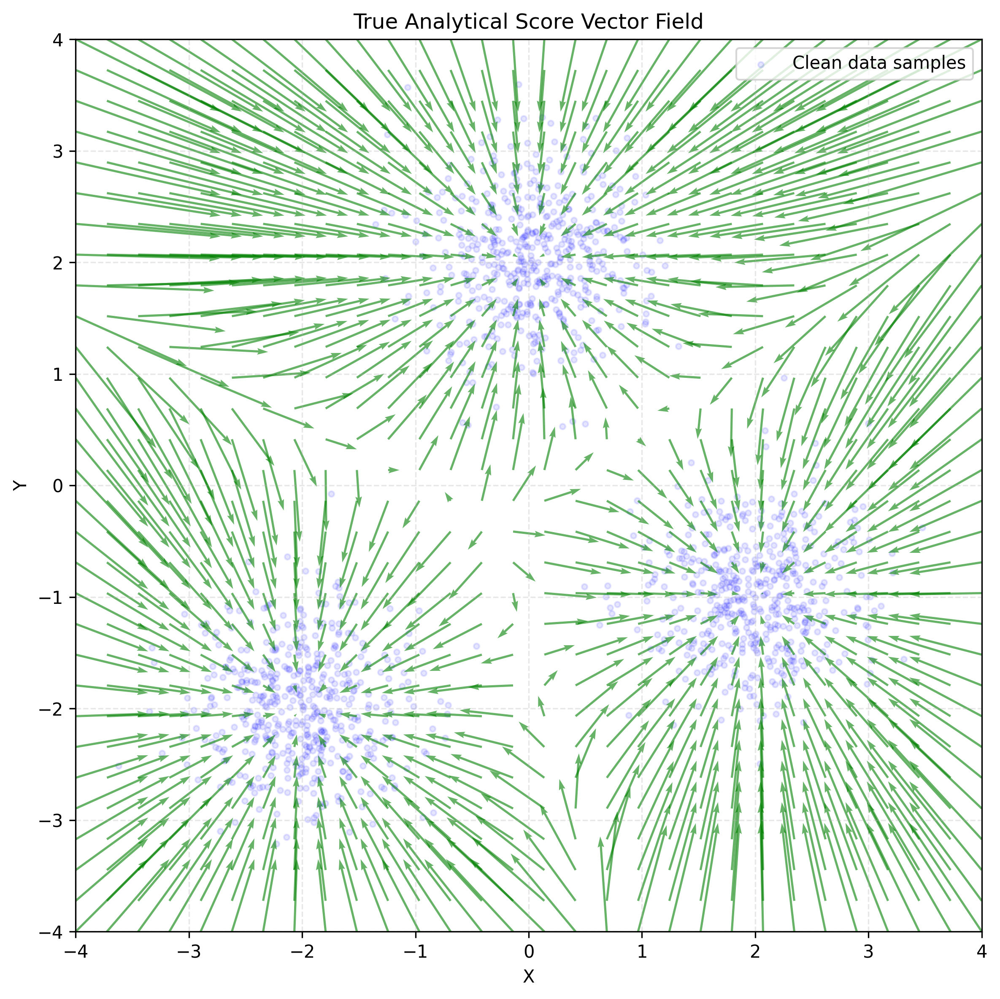
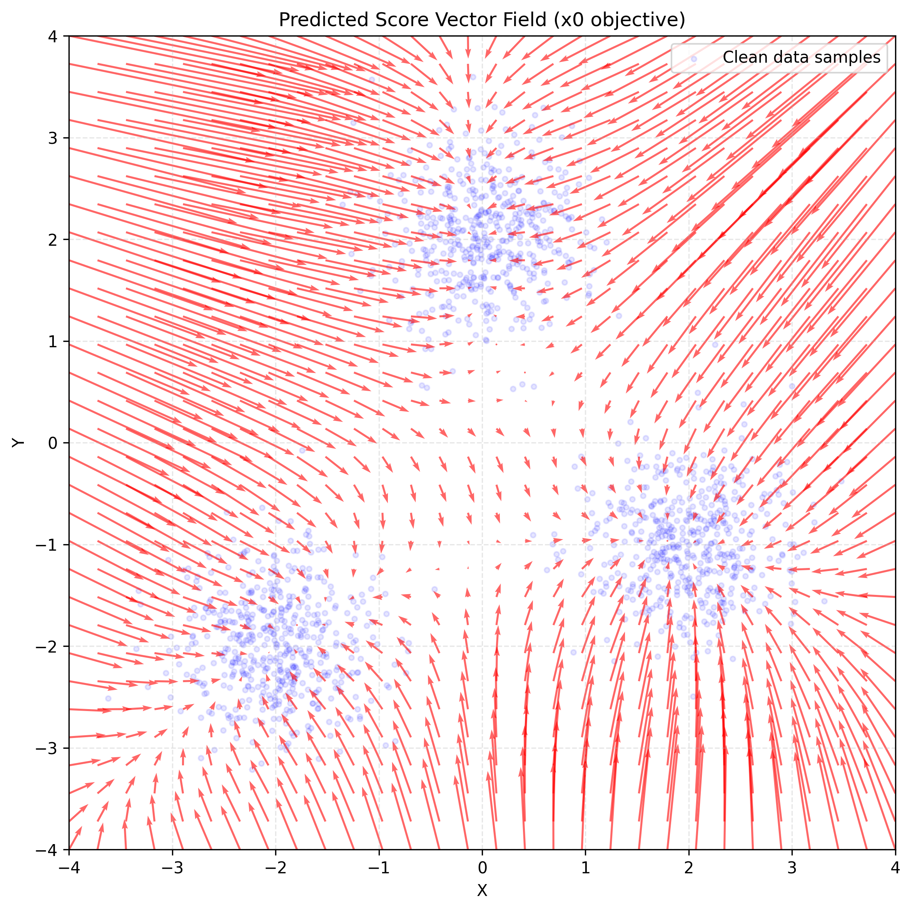
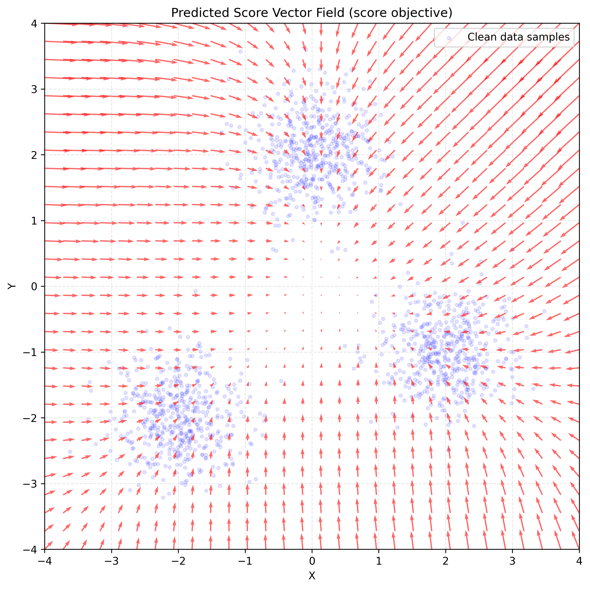

# Checkpoint 02 - Toy Score Matching Report

## Summary

This experiment evaluates whether a small neural network can learn the score of
a noisy 2D Gaussian mixture. I compared two training objectives under the same
architecture, learning rate, iteration budget, and random seed:

1. Predict the clean sample $x_0$ and convert that prediction to a score.
2. Predict the score directly.

Under this fixed configuration, the $x_0$ objective achieved a lower validation
score MSE (`0.728`) than direct score prediction (`1.407`). This is a result for
these two runs, not yet evidence that $x_0$ prediction is generally the better
objective.

## Experimental Setup

- **Dataset:** An equal-weight mixture of three 2D Gaussian components with
  1,500 total samples. The component centers were $(-2,-2)$, $(0,2)$, and
  $(2,-1)$, and each component had standard deviation
  $\sigma_{\text{cluster}}=0.5$.
- **Split:** 80% training and 20% validation, using seed `42`.
- **Model:** A `2 -> 32 -> 32 -> 2` ReLU MLP. See [model.py](model.py).
- **Optimization:** Full-batch SGD with learning rate `0.1` for 20 iterations.
- **Forward noise:** One fixed Gaussian corruption level with
  $\sigma=0.5$.

The forward process was

$$
x_t=x_0+\sigma\epsilon,
\qquad
\epsilon\sim\mathcal N(0,I).
$$

This is one fixed noise level, not yet a complete diffusion trajectory.

### Why the component centers matter

The three centers are the means of the Gaussian components that generated the
dataset. They are not the 1,500 observed samples. After adding forward noise,
the variances add, so each noisy component has standard deviation

$$
\sigma_t
=
\sqrt{\sigma_{\text{cluster}}^2+\sigma^2}
=
\sqrt{0.5^2+0.5^2}.
$$

The exact score of the noisy mixture is a responsibility-weighted average of
the three component scores:

$$
\nabla_x\log p_t(x)
=
\sum_{k=1}^{3}
r_k(x)\frac{\mu_k-x}{\sigma_t^2},
$$

where $r_k(x)$ is the posterior responsibility of component $k$ at point $x$.
This exact score gives us a reference that would normally be unavailable for a
real dataset.

### Training objectives

For the $x_0$ objective, the model predicts the clean sample. At evaluation
time, I convert that prediction to a score using

$$
\hat s_\theta(x_t)
=
\frac{\hat x_{0,\theta}(x_t)-x_t}{\sigma^2}.
$$

For direct score prediction, the training target is the conditional Gaussian
score

$$
-\frac{x_t-x_0}{\sigma^2}
=
-\frac{\epsilon}{\sigma}.
$$

The evaluation metric, `val_score_mse`, is the mean squared coordinate error
between the model score and the exact noisy-mixture score on held-out
validation samples. Both objectives are therefore evaluated in the same score
space.

### Source Boundary

The direct-score target $-\epsilon/\sigma$ is the Gaussian conditional-score
target used by [Vincent (2011)](../../sources/vincent_2011_score_matching/).
The paper proves that regression against this conditional target is equivalent
to matching the score of the Gaussian-smoothed empirical density. Its further
equivalence to a reconstruction objective uses a particular tied-weight
denoising autoencoder and associated energy function.

This checkpoint instead compares two generic MLP parameterizations under a
short shared training budget. The paper therefore supports the interpretation
of the target, but it does not predict that these two runs should optimize
identically or explain the observed difference in their validation score MSE.

## Visual Evidence

| **True Analytical Vector Field**                                            | **$x_0$ Objective**                                                                                  | **Score Objective**                                                                                      |
| --------------------------------------------------------------------------- | ---------------------------------------------------------------------------------------------------- | -------------------------------------------------------------------------------------------------------- |
|  |  |  |

Both learned fields point generally toward the high-density regions. The
$x_0$ field more closely reproduces the three attraction regions, which agrees
with its lower validation score MSE.

## Quantitative Results

| Objective | Final validation objective loss | Validation score MSE | Training runtime |
| --------- | ------------------------------: | -------------------: | ---------------: |
| $x_0$     |                        0.181885 |             0.727958 |          5.149 s |
| Score     |                        3.472780 |             1.407152 |          1.199 s |

The objective losses are not directly comparable because the two models use
targets with different scales. The validation score MSE is the common metric
for comparing their learned score fields.

The runtimes are included for completeness, but they are not a reliable speed
comparison. These are single, very short runs, and startup and device warm-up
costs are large relative to the training time.

Evaluated run IDs:

- `$x_0$`: `toy_score_matching_exp_20260724_222901_1784932141.538715`
- `score`: `toy_score_matching_exp_20260724_222934_1784932174.2667751`

## Findings

The main observed result is that $x_0$ prediction produced the lower score
error under this fixed training budget. Direct score prediction remained
relatively underfit after 20 iterations.

One possible explanation is the variance of the direct score target. Since the
target is $-\epsilon/\sigma$, each coordinate has variance
$1/\sigma^2=4$ when $\sigma=0.5$. This could make the direct target harder to
fit with the same learning rate and iteration budget. The experiment suggests
this hypothesis, but does not confirm it.

## Limitations and Failure Analysis

- I tested only one seed, architecture, learning rate, and noise level.
- The same hyperparameters may not be equally suitable for both objectives.
- The direct score model was still underfit at the end of the 20 iterations.
- The known Gaussian mixture makes an exact score comparison possible, but
  this does not represent the difficulty of an unknown real-data distribution.
- This checkpoint does not include timestep conditioning, multiple noise
  levels, or reverse-process sampling.

## What I Learned

- The centers in the analytic mixture are the generating component means, not
  all of the sampled observations.
- Adding independent Gaussian noise adds variances, not standard deviations.
- An $x_0$ predictor can be converted into a score predictor through the
  Gaussian denoising identity.
- Two objectives can have different raw loss scales, so they need a shared
  evaluation metric.
- A failed or underfit run is still useful when the report states clearly what
  happened and what remains uncertain.

## Next Steps

- Train both objectives for a longer fixed budget to test whether the current
  difference is mainly caused by early stopping.
- Repeat the comparison across multiple seeds before making a general claim.
- Explore whether target scaling, learning rate, or model capacity improves
  direct score prediction.
- Continue building Nano-Diffusion step by step, later adding multiple noise
  levels, timestep conditioning, and reverse sampling.
