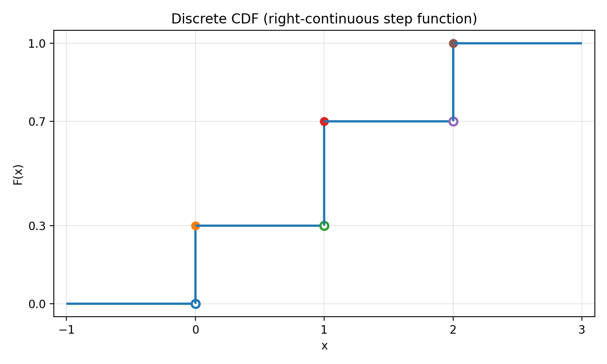
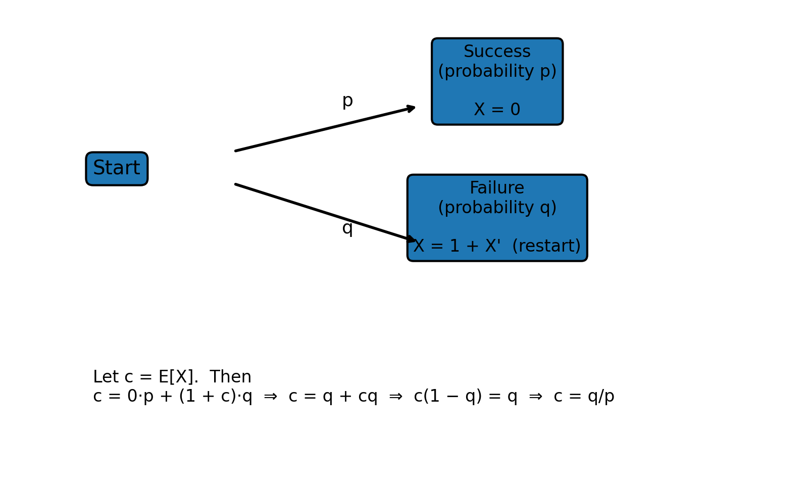

# Notes for Lectures 9 (Expectation, Indicator Random Variables, Linearity)

## [Lecture 9](https://www.youtube.com/watch?v=LX2q356N2rU&list=PL2SOU6wwxB0uwwH80KTQ6ht66KWxbzTIo&index=9): Expectation, Indicator Random Variables, Linearity

**Lecture 9:** Expectation, Indicator Random Variables, Linearity  
**Course:** Statistics 110 (Harvard) — Prof. Joe Blitzstein

---

## 1) CDF (Cumulative Distribution Function)

**Definition.** For a random variable $X$, the CDF is

$$F(x) = \mathbb{P}(X \le x), \qquad x \in \mathbb{R}.$$

**Sketch (discrete step CDF):**

- 

### Using the CDF to get probabilities

Example goal: compute $\mathbb{P}(1 < X \le 3)$ using $F$.

$$\mathbb{P}(X \le 1) + \mathbb{P}(1 < X \le 3) = \mathbb{P}(X \le 3).$$

So

$$\mathbb{P}(1 < X \le 3) = F(3) - F(1).$$

In general:

$$\boxed{\mathbb{P}(a < X \le b) = F(b) - F(a).}$$

**Small bridge (endpoint subtlety).** If you ever need $\mathbb{P}(a \le X \le b)$ for a distribution that may have point masses, it’s useful to remember the left-limit:

$$\mathbb{P}(a \le X \le b) = F(b) - F(a^-), \quad \text{where } F(a^-) = \lim_{x \uparrow a} F(x).$$

---

## 2) CDF properties

A valid CDF $F$ is:

1. **Increasing** (non-decreasing).
2. **Right-continuous**.
3. Has the correct limits:
   - $F(x) \to 0$ as $x \to -\infty$
   - $F(x) \to 1$ as $x \to +\infty$

---

## 3) Independence (in terms of CDF / PMF)

**General CDF statement.** $X$ and $Y$ are independent if

$$\mathbb{P}(X \le x,\ Y \le y) = \mathbb{P}(X \le x)\,\mathbb{P}(Y \le y) \quad \text{for all } x,y.$$

**Discrete case (PMF statement).** $X$ and $Y$ are independent if

$$\mathbb{P}(X=x,\ Y=y) = \mathbb{P}(X=x)\,\mathbb{P}(Y=y) \quad \text{for all } x,y.$$

---

## 4) Averages (means / expected values) as “weighted averages”

**Plain average (finite list).** For $1,2,3,4,5,6$:

$$\frac{1+2+3+4+5+6}{6} = 3.5.$$

Also,

$$\frac{1}{n}\sum_{j=1}^n j = \frac{n+1}{2}.$$

**Weighted average example.** If the data are

$$1,1,1,1,1,3,3,5$$

then the mean can be computed as a weighted average:

$$\frac{5}{8}\cdot 1 + \frac{2}{8}\cdot 3 + \frac{1}{8}\cdot 5.$$

---

## 5) Expectation of a discrete random variable

The expectation $E(X)$ is the weighted average of the possible values, where the weights are the probabilities (PMF).

If $X$ is discrete with pmf $p_X(x) = \mathbb{P}(X=x)$, then

$$\boxed{\mathbb{E}[X] = \sum_x x\,\mathbb{P}(X=x),}$$

where the sum is over all $x$ with $\mathbb{P}(X=x) > 0$.

---

## 6) Bernoulli and indicator random variables

An Indicator Random Variable $X = I_A$ for an event $A$ is defined as:

$$
X = \begin{cases}
1, & \text{if } A \text{ occurs} \\
0, & \text{otherwise}
\end{cases}
$$

### Bernoulli($p$)

If $X \sim \text{Bern}(p)$, then $X\in\{0,1\}$ and

$$\mathbb{E}[X] = 1\cdot \mathbb{P}(X=1) + 0\cdot \mathbb{P}(X=0) = p.$$

### Indicator random variable

Define the indicator of event $A$:

$$
\mathbf{1}_A = \begin{cases}
1, & \text{if } A \text{ occurs} \\
0, & \text{otherwise.}
\end{cases}
$$

Then

$$\boxed{\mathbb{E}[\mathbf{1}_A] = \mathbb{P}(A).}$$

This is a **fundamental bridge** between probability and expectation.

---

## 7) Binomial expectation (two ways)

Let $X \sim \text{Bin}(n,p)$ (with $q = 1-p$).

### Way 1: compute from the pmf

$$\mathbb{E}[X] = \sum_{k=0}^n k\binom{n}{k}p^k q^{n-k}.$$

Rewrite (start at $k=1$ since the $k=0$ term is 0):

$$\mathbb{E}[X]
= \sum_{k=1}^n k\binom{n}{k}p^k q^{n-k}
= \sum_{k=1}^n n\binom{n-1}{k-1}p^k q^{n-k}.$$

Factor out $np$ and re-index with $j=k-1$:

$$\mathbb{E}[X]
= np \sum_{k=1}^n \binom{n-1}{k-1}p^{k-1} q^{(n-1)-(k-1)}
= np \sum_{j=0}^{n-1} \binom{n-1}{j}p^j q^{(n-1)-j}.$$

By the binomial theorem, the sum equals $(p+q)^{n-1} = 1$. Hence

$$\boxed{\mathbb{E}[X] = np.}$$

### Way 2 (bridge): indicators + linearity

Write $X = X_1 + X_2 + \dots + X_n$, where $X_i$ is the indicator that trial $i$ is a success.

- Each $X_i \sim \text{Bern}(p)$ so $\mathbb{E}[X_i]=p$.
- By linearity:

$$\mathbb{E}[X] = \mathbb{E}[X_1+\dots+X_n] = \sum_{i=1}^n \mathbb{E}[X_i] = np.$$

---

## 8) Linearity of expectation

Linearity is the rule that lets you “pull sums apart”:

$$\boxed{\mathbb{E}[X+Y] = \mathbb{E}[X] + \mathbb{E}[Y].}$$

**Important:** This holds **even if $X$ and $Y$ are dependent**.

Scaling by constants:

$$\boxed{\mathbb{E}[cX] = c\,\mathbb{E}[X] \quad (c \text{ constant}).}$$

(And more generally, $\mathbb{E}[aX+b] = a\mathbb{E}[X] + b$.)

---

## 9) Hypergeometric expectation via indicators

**Example:** 5-card hand. Let $X =$ number of aces.

Let $X_j$ be the indicator that the $j$-th card is an ace, $1 \le j \le 5$.

$$X = X_1 + X_2 + \dots + X_5.$$

So by linearity:

$$\mathbb{E}[X] = \sum_{j=1}^5 \mathbb{E}[X_j].$$

By symmetry, all $\mathbb{E}[X_j]$ are the same:

$$\mathbb{E}[X] = 5\,\mathbb{E}[X_1] = 5\,\mathbb{P}(\text{1st card is an ace}) = 5\cdot \frac{4}{52} = \frac{5}{13}.$$

Even though the $X_j$’s are **dependent**, linearity still works.

**Bridge (general hypergeometric mean).** If you sample $n$ items without replacement from a population of size $N$ with $K$ “successes”, then

$$\boxed{\mathbb{E}[X] = n\cdot \frac{K}{N}.}$$

---

## 10) Geometric distribution (failures before first success)

Consider independent Bernoulli($p$) trials.

**Convention used here:** $X$ counts the number of **failures before the first success**.

Then $X \sim \text{Geom}(p)$ with pmf

$$\mathbb{P}(X=k) = q^k p, \qquad k \in \{0,1,2,\dots\}, \quad q=1-p.$$

Example: $FFFFFS$ (5 failures then success) means

$$\mathbb{P}(X=5) = q^5 p.$$

### Validity check

$$\sum_{k=0}^{\infty} \mathbb{P}(X=k) = \sum_{k=0}^{\infty} p q^k = \frac{p}{1-q} = 1.$$

### Expectation

$$\mathbb{E}[X] = \sum_{k=0}^{\infty} k\,p q^k.$$

Using the known series $\sum_{k=0}^{\infty} k q^k = \frac{q}{(1-q)^2}$ (for $|q|<1$):

$$\mathbb{E}[X] = p\cdot \frac{q}{(1-q)^2} = p\cdot \frac{q}{p^2} = \boxed{\frac{q}{p}}.$$

### “Story proof”

Let $c = \mathbb{E}[X]$.

- With probability $p$, you succeed immediately: $X=0$.
- With probability $q$, you fail once, and then you are “back where you started” (expected remaining failures is again $c$).

So

$$c = 0\cdot p + (1+c)\cdot q = q + cq \quad\Rightarrow\quad c(1-q)=q \quad\Rightarrow\quad c=\frac{q}{p}.$$

**Note on conventions.** If instead $Y$ counts the number of trials until the first success (so $Y\in\{1,2,3,\dots\}$), then $\mathbb{E}[Y]=1/p$. (Here $Y=X+1$.)

- 
