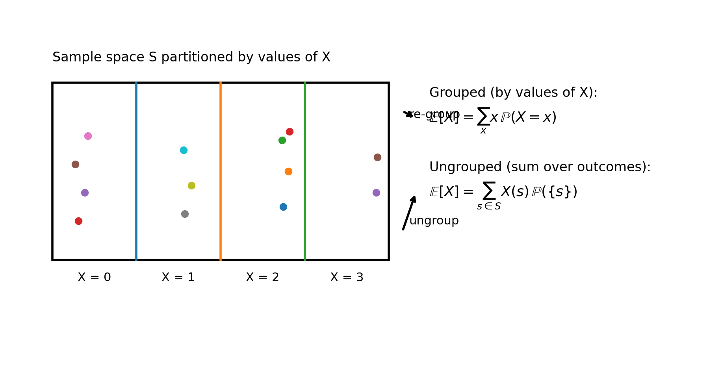

# Stat 110 (Blitzstein) — Lecture 10

**Lecture 10:** [Expectation (continued)](https://www.youtube.com/watch?v=P1fSFvhPf7Q&list=PL2SOU6wwxB0uwwH80KTQ6ht66KWxbzTIo&index=10)  
**Course:** Statistics 110 (Harvard) — Prof. Joe Blitzstein

---

## 1) Proof idea for linearity of expectation (discrete)

Goal: if $T = X + Y$, show

$$\mathbb{E}[T] = \mathbb{E}[X] + \mathbb{E}[Y].$$

A naive attempt (that gets you stuck) is to write:

$$\sum_t t\,\mathbb{P}(T=t) \stackrel{?}{=} \sum_x x\,\mathbb{P}(X=x) + \sum_y y\,\mathbb{P}(Y=y).$$

You can also write (law of total probability)

$$\mathbb{P}(T=t) = \sum_x \mathbb{P}(T=t \mid X=x)\,\mathbb{P}(X=x),$$

but that doesn’t immediately simplify to something like $\mathbb{E}[X]+\mathbb{E}[Y]$.

### Key bridge: “grouped” vs “ungrouped” expectation

Think of a probability space $S$ (sample space). A discrete random variable is a function $X:S\to \mathbb{R}$.

- **Grouped (by values of $X$):**

$$\mathbb{E}[X] = \sum_x x\,\mathbb{P}(X=x).$$

- **Ungrouped (sum over outcomes $s\in S$):**

$$\mathbb{E}[X] = \sum_{s\in S} X(s)\,\mathbb{P}(\{s\}).$$

Same quantity, just two ways of organizing the sum.

- 

### Concrete example

Roll a fair die; let $X=1$ if odd, $X=0$ if even. Sample space $S=\{1,2,3,4,5,6\}$, each with prob $\frac{1}{6}$.

**Ungrouped** (sum over die faces):

$$\mathbb{E}[X] = 1\cdot\tfrac{1}{6} + 0\cdot\tfrac{1}{6} + 1\cdot\tfrac{1}{6} + 0\cdot\tfrac{1}{6} + 1\cdot\tfrac{1}{6} + 0\cdot\tfrac{1}{6} = \tfrac{1}{2}.$$

**Grouped** (sum over values 0 and 1):

$$\mathbb{E}[X] = 1\cdot P(X{=}1) + 0\cdot P(X{=}0) = 1\cdot\tfrac{1}{2} + 0\cdot\tfrac{1}{2} = \tfrac{1}{2}.$$

Same answer, different bookkeeping. The ungrouped form generalizes cleanly to sums of random variables.

---

## 2) Proof of linearity (discrete) using the "ungrouped" form

Let $T=X+Y$ (as random variables on the same space $S$). Then

$$\mathbb{E}[T] = \sum_{s\in S} T(s)\,\mathbb{P}(\{s\})
= \sum_{s\in S} (X(s)+Y(s))\,\mathbb{P}(\{s\}).$$

Distribute the sum:

$$\mathbb{E}[T]
= \sum_{s\in S} X(s)\,\mathbb{P}(\{s\}) + \sum_{s\in S} Y(s)\,\mathbb{P}(\{s\})
= \mathbb{E}[X] + \mathbb{E}[Y].$$

So:

$$\boxed{\mathbb{E}[X+Y]=\mathbb{E}[X]+\mathbb{E}[Y] \text{ (no independence needed).}}$$

Similarly, if $c$ is a constant:

$$\boxed{\mathbb{E}[cX] = c\,\mathbb{E}[X].}$$

**Extreme dependent case check:** if $X=Y$, then

$$\mathbb{E}[X+Y] = \mathbb{E}[2X] = 2\mathbb{E}[X] = \mathbb{E}[X]+\mathbb{E}[Y].$$

---

## 3) Negative Binomial distribution

**Story (params $r,p$):** independent $\text{Bern}(p)$ trials;  
$X$ = **number of failures before the $r$-th success**.

(Example mental picture: a 0/1 string ending in a 1, with $r$ total ones; the last one is the $r$-th success.)

### PMF

For $n=0,1,2,\dots$:

$$\mathbb{P}(X=n) = \binom{n+r-1}{r-1}\,p^r(1-p)^n.$$

Reason: among the first $n+r-1$ trials you must have $r-1$ successes and $n$ failures, and the last trial is a success.

### Expectation via “sum of geometrics”

Write

$$X = X_1 + X_2 + \dots + X_r,$$

where $X_j$ is the number of failures between the $(j-1)$-st and $j$-th success. Then each

$$X_j \sim \text{Geom}(p) \quad \text{(failures before a success)},$$

so

$$\mathbb{E}[X_j]=\frac{1-p}{p}.$$

By linearity:

$$\boxed{\mathbb{E}[X] = r\cdot \frac{1-p}{p}.}$$

---

## 4) “First Success” (time until first success)

Define $X$ = **number of trials until the first success**, counting the success.  
This is the geometric distribution under the “count trials” convention (support $\{1,2,\dots\}$).

Connect it to the “failures before success” convention by letting

$$Y = X - 1,$$

so $Y\sim \text{Geom}(p)$ (failures before success). Then

$$\mathbb{E}[X] = \mathbb{E}[Y] + 1 = \frac{1-p}{p} + 1 = \boxed{\frac{1}{p}}.$$

---

## 5) Putnam-style example: expected number of local maxima in a random permutation

Let $(a_1,a_2,\dots,a_n)$ be a uniformly random permutation of $1,2,\dots,n$ (assume $n>2$).

Define indicator variables:

$$I_j = \begin{cases}
1, & \text{if position } j \text{ is a local maximum}\\
0, & \text{otherwise.}
\end{cases}$$

Then the number of local maxima is

$$L = I_1 + I_2 + \dots + I_n,$$

and by linearity

$$\mathbb{E}[L] = \sum_{j=1}^n \mathbb{E}[I_j] = \sum_{j=1}^n \mathbb{P}(I_j=1).$$

### Probabilities

- **Interior positions** $j=2,\dots,n-1$: among $(a_{j-1},a_j,a_{j+1})$, each of the three values is equally likely to be the largest, so

$$\mathbb{P}(I_j=1) = \frac{1}{3}.$$

- **Endpoints** $j=1$ and $j=n$: compare to the only neighbor; by symmetry,

$$\mathbb{P}(I_1=1)=\mathbb{P}(I_n=1)=\frac{1}{2}.$$

So:

$$\mathbb{E}[L] = (n-2)\cdot \frac{1}{3} + 2\cdot \frac{1}{2}
= \frac{n-2}{3} + 1
= \boxed{\frac{n+1}{3}}.$$

---

## 6) St. Petersburg paradox

Flip a fair coin until the first Head.

Let $X$ = number of flips until the first Head **including** the success. Then

$$\mathbb{P}(X=k)=\left(\frac{1}{2}\right)^k,\quad k=1,2,\dots$$

Define the payoff

$$Y = 2^X.$$

### Compute $\mathbb{E}[Y]$

$$\mathbb{E}[Y] = \sum_{k=1}^{\infty} 2^k \,\mathbb{P}(X=k)
= \sum_{k=1}^{\infty} 2^k \left(\frac{1}{2}\right)^k
= \sum_{k=1}^{\infty} 1
= \infty.$$

So the expected payoff is infinite (this is the “paradox”).

### Truncated payoff (bounded at $2^{40}$)

If you cap the payoff so it never exceeds $2^{40}$, then the expected value becomes finite:

$$\sum_{k=1}^{40} 2^k\left(\frac{1}{2}\right)^k = 40.$$

### Reminder: $\mathbb{E}[g(X)] \ne g(\mathbb{E}[X])$ in general

Here:

- $\mathbb{E}[2^X]=\infty$,
- but $\mathbb{E}[X]=2$ for a fair coin (geometric time to first success),
- so $2^{\mathbb{E}[X]} = 2^2 = 4$.

Thus:

$$\mathbb{E}[2^X] = \infty \ne 2^{\mathbb{E}[X]} = 4.$$
