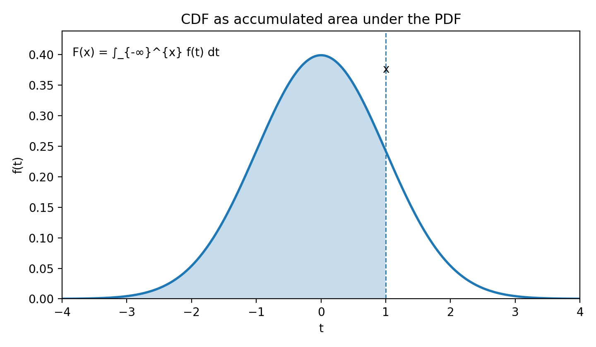
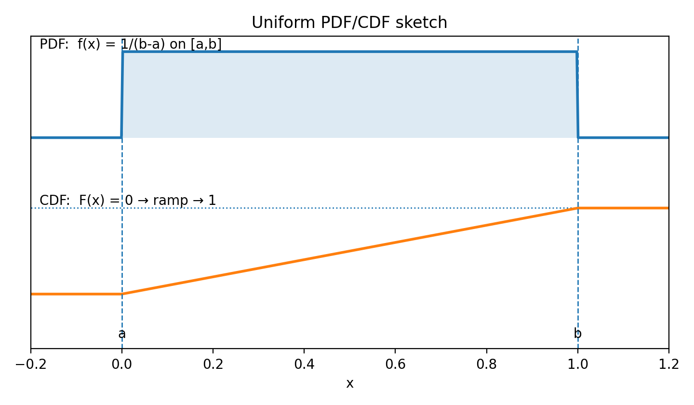
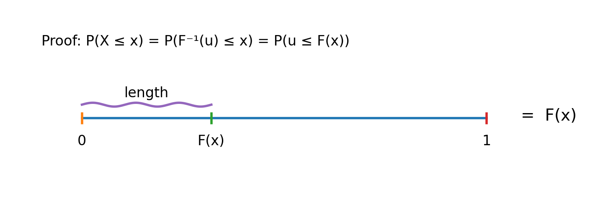

# Stat 110 (Blitzstein) — Lecture 12

**Lecture 12:** [Discrete vs Continuous; the Uniform](https://www.youtube.com/watch?v=Tci---bVs60&list=PL2SOU6wwxB0uwwH80KTQ6ht66KWxbzTIo&index=12)  
**Course:** Statistics 110 (Harvard) — Prof. Joe Blitzstein

---

## Summary Table — Discrete vs Continuous (at a glance)

| Concept               | Discrete random variable $X$                          | Continuous random variable $X$                                                               |
| --------------------- | ----------------------------------------------------- | -------------------------------------------------------------------------------------------- |
| **PMF / PDF**         | **PMF:** $$p_X(x)=\mathbb{P}(X=x)$$                   | **PDF:** $$f_X(x)$$ (density; not a probability) $$\mathbb{P}(X=x)=0 \ \text{for all }x$$ |
| **CDF**               | $$F_X(x)=\mathbb{P}(X\le x)$$                         | $$F_X(x)=\mathbb{P}(X\le x)$$                                                                |
| **$\mathbb{E}[X]$**   | $$\mathbb{E}[X]=\sum_x x\,\mathbb{P}(X=x)$$           | $$\mathbb{E}[X]=\int_{-\infty}^{\infty} x\,f_X(x)\,dx$$                                      |
| **$\mathrm{Var}(X)$** | $$\mathrm{Var}(X)=\mathbb{E}[X^2]-(\mathbb{E}[X])^2$$ | $$\mathrm{Var}(X)=\mathbb{E}[X^2]-(\mathbb{E}[X])^2$$                                        |
| **LOTUS**             | $$\mathbb{E}[g(X)]=\sum_x g(x)\,\mathbb{P}(X=x)$$     | $$\mathbb{E}[g(X)]=\int_{-\infty}^{\infty} g(x)\,f_X(x)\,dx$$                                |

---

## 1) PDF definition + properties

**Def.** A continuous random variable $X$ has PDF $f(x)$ if for all $a,b$:

$$\mathbb{P}(a\le X\le b)=\int_a^b f(x)\,dx.$$

$f(x)$ is **not** a probability; it is what you integrate to get probabilities.

Sanity checks / validity conditions:

- If $a=b$, then $\mathbb{P}(a\le X\le a)=\int_a^a f(x)\,dx = 0.$
  (An integral over a zero-width interval is zero; hence $\mathbb{P}(X=x)=0$ for any single point.)
- $f(x)\ge 0.$
  (Probabilities cannot be negative, so the integrand must be non-negative.)
- $\int_{-\infty}^{\infty} f(x)\,dx = 1.$
  (This integral equals $\mathbb{P}(-\infty < X < \infty)$, the probability that $X$ takes some value, which must be 1.)

**Small-interval approximation (density intuition).** For $\varepsilon>0$ very small:
$$f(x_0)\,\varepsilon \approx \mathbb{P}\!\left(x_0-\frac{\varepsilon}{2} \le X \le x_0+\frac{\varepsilon}{2}\right).$$

---

## 2) CDF from PDF

If $X$ has PDF $f$, then the CDF is:

$$F(x)=\mathbb{P}(X\le x)=\int_{-\infty}^{x} f(t)\,dt.$$

- 

---

## 3) Derivative of CDF = PDF (Fundamental Theorem of Calculus)

If $X$ has CDF $F$ (and $X$ is a continuous random variable), then

$$f(x)=F'(x) \quad \text{(by the Fundamental Theorem of Calculus).}$$

Also:

$$\mathbb{P}(a\le X\le b)=\int_a^b f(x)\,dx = F(b)-F(a) \quad \text{(by FTC).}$$

---

## 4) Variance + standard deviation

$$\mathrm{Var}(X)=\mathbb{E}\!\left[(X-\mathbb{E}[X])^2\right].$$

Standard deviation:
$$\mathrm{SD}(X)=\sqrt{\mathrm{Var}(X)} \quad \Rightarrow \quad \text{keeps units.}$$

### Another way to express variance (your derivation)

Start with:
$$\mathrm{Var}(X)=\mathbb{E}\!\left[(X-\mathbb{E}[X])^2\right].$$

Expand inside:
$$(X-\mathbb{E}[X])^2 = X^2 - 2X\mathbb{E}[X] + (\mathbb{E}[X])^2.$$

Take expectation (linearity):

$$
\mathrm{Var}(X)
= \mathbb{E}[X^2] - 2\,\mathbb{E}[X]\,\mathbb{E}[X] + (\mathbb{E}[X])^2
= \mathbb{E}[X^2] - (\mathbb{E}[X])^2.
$$

(Notation: $\mathbb{E}X^2$ is shorthand for $\mathbb{E}[X^2]$.)

---

## 5) Simplest continuous distribution: Uniform

$X\sim \mathrm{Unif}(a,b)$ means a “completely random point in $[a,b]$”.

Uniform idea: **probability $\propto$ length**.

### PDF of $\mathrm{Unif}(a,b)$

Assume

$$
f(x)=
\begin{cases}
c, & a\le x\le b\\
0, & \text{otherwise}
\end{cases}
$$

Use total probability $1$:
$$1=\int_a^b c\,dx \Rightarrow c=\frac{1}{b-a}.$$

So:

$$
f(x)=
\begin{cases}
\frac{1}{b-a}, & a\le x\le b\\
0, & \text{otherwise.}
\end{cases}
$$

### CDF of $\mathrm{Unif}(a,b)$

$$
F(x)=\int_{-\infty}^{x} f(t)\,dt
=
\begin{cases}
0, & x<a\\[4pt]
\int_a^x \frac{1}{b-a}\,dt=\frac{x-a}{b-a}, & a\le x\le b\\[8pt]
1, & x>b
\end{cases}
$$

- 

---

## 6) Mean of $\mathrm{Unif}(a,b)$

$$
\mathbb{E}[X]=\int_a^b x\cdot \frac{1}{b-a}\,dx
=\frac{1}{b-a}\int_a^b x\,dx
=\frac{1}{b-a}\left[\frac{x^2}{2}\right]_a^b
=\frac{b^2-a^2}{2(b-a)}
=\frac{a+b}{2}.
$$

Average is in the middle (uniform).

---

## 7) LOTUS (Law of the Unconscious Statistician)

Goal idea: compute $\mathbb{E}[X^2]$ without needing the PDF of $Y=X^2$.

Let $Y=X^2$. Then:
$$\mathbb{E}[X^2]=\mathbb{E}[Y].$$

But instead of finding the distribution of $Y$, use LOTUS:

### Continuous LOTUS

$$\boxed{\mathbb{E}[g(X)] = \int_{-\infty}^{\infty} g(x)\,f_X(x)\,dx}$$

This formula looks like a shortcut—just plug $g(x)$ into the integral without deriving the distribution of $Y=g(X)$—but it is a rigorous theorem.

(“lazy approach is TRUE!”)

### Discrete LOTUS

$$\boxed{\mathbb{E}[g(X)] = \sum_x g(x)\,\mathbb{P}(X=x)}$$

---

## 8) Example: $U\sim \mathrm{Unif}(0,1)$

$$\mathbb{E}[U]=\frac{1}{2}.$$

$$\mathbb{E}[U^2]=\int_0^1 u^2 f_U(u)\,du = \int_0^1 u^2\,du = \frac{1}{3}.$$

So:

$$
\mathrm{Var}(U)=\mathbb{E}[U^2]-(\mathbb{E}[U])^2
=\frac{1}{3}-\frac{1}{4}=\frac{1}{12}.
$$

---

## 9) Uniform is universal (Inverse CDF method)

Given a uniform, you can generate (many) other distributions.

Let:

- $U\sim \mathrm{Unif}(0,1)$
- $F$ be a CDF (assume $F$ is strictly increasing and continuous)

**Theorem.** Let
$$X = F^{-1}(U).$$
Then
$$X \sim F.$$

### Proof sketch

$$
\mathbb{P}(X\le x)
=\mathbb{P}(F^{-1}(U)\le x)
=\mathbb{P}(U\le F(x))
=F(x).
$$

- 
