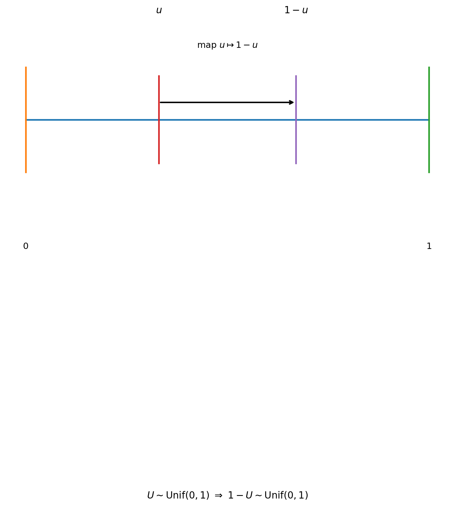
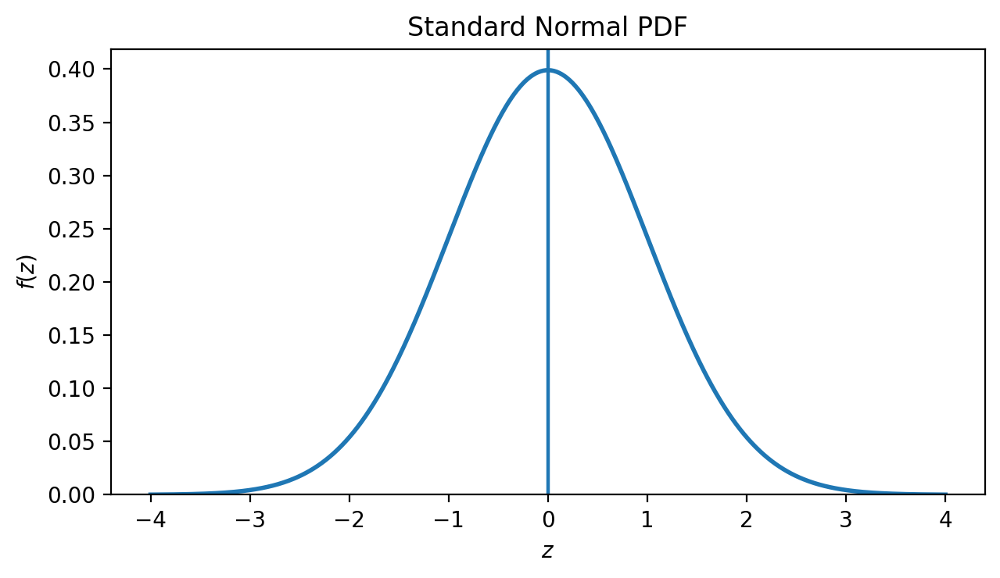
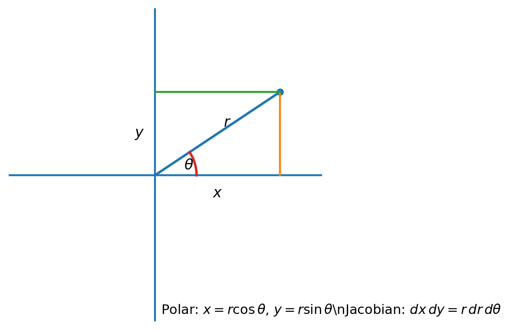

# Stat 110 (Blitzstein) — Lecture 13

**Lecture 13:** [Normal Distribution](https://www.youtube.com/watch?v=72QjzHnYvL0&list=PL2SOU6wwxB0uwwH80KTQ6ht66KWxbzTIo&index=13)  
**Course:** Statistics 110 (Harvard) — Prof. Joe Blitzstein

---

## 1) “Universality of Uniform” (a.k.a. inverse CDF method)

Let $F$ be a **continuous, strictly increasing** CDF (so it has an inverse $F^{-1}$).

### (A) From Uniform to any distribution (simulate from $F$)

If

- $U \sim \text{Unif}(0,1)$
- define $$X = F^{-1}(U),$$

then $$X \sim F.$$

This is the basic **simulation trick**: start with uniform noise and transform it through $F^{-1}$.

### (B) From any distribution to Uniform

If

- $X \sim F$ (and $F$ is continuous),

then $$F(X) \sim \text{Unif}(0,1).$$

**Meaning:** “plug $X$ into its own CDF.”

---

### Important clarification (common mistake)

We always have (definition of CDF)

$$F(x) = \mathbb{P}(X \le x).$$

But be careful: $F(X)$ is a **random variable**. A wrong interpretation is:

$$F(X) \stackrel{\text{wrong}}{=} \mathbb{P}(X \le X) = 1.$$

What’s wrong?

- $\mathbb{P}(X \le X)=1$ is a (trivial) probability statement.
- $F(X)$ means: **take the realized value** $X(\omega)$ and evaluate $F$ at that number.

So $F(X)$ is not the probability of the event $X \le X$; it’s the _number_ $F(X(\omega))$.

---

## 2) Example: Exponential(1) via inverse CDF

Let $X \sim \text{Expo}(1)$. Its CDF is

$$
F(x)=
\begin{cases}
0, & x \le 0,\\
1-e^{-x}, & x>0.
\end{cases}
$$

Take $U \sim \text{Unif}(0,1)$ and set $X = F^{-1}(U)$.

**Goal:** Find $F^{-1}(u)$ by solving $F(x) = u$ for $x$.

Solve for the inverse step by step:

1. Set the CDF equal to $u$: $u = 1 - e^{-x}$.

2. Isolate the exponential term (subtract 1 from both sides, then multiply by $-1$):
   $u - 1 = -e^{-x}$ and $1 - u = e^{-x}$.

3. Take the natural logarithm of both sides: $\ln(1-u) = \ln(e^{-x})$.

4. Simplify the right side using $\ln(e^a) = a$: $\ln(1-u) = -x$.

5. Multiply both sides by $-1$ to solve for $x$: $x = -\ln(1-u)$.

Therefore,

$$F^{-1}(u) = -\ln(1-u).$$

---

### Concrete example

Suppose we sample $U = 0.7$ from $\text{Unif}(0,1)$. Then:

$$X = -\ln(1 - 0.7) = -\ln(0.3) \approx -(-1.204) \approx 1.204$$

So this single draw gives us $X \approx 1.204$, which is a sample from $\text{Expo}(1)$.

**In code (Python):**
```python
import numpy as np

# Sample from Unif(0,1)
u = np.random.uniform(0, 1)  # e.g., u = 0.7

# Transform to Expo(1)
x = -np.log(1 - u)           # x ≈ 1.204
```

**Why this works:** The inverse CDF "maps" uniform probability mass to the correct regions. Values of $U$ near 1 produce large $X$ (since $-\ln(1-u) \to \infty$ as $u \to 1$), which matches the long right tail of the exponential.

---

So the simulation recipe is:

$$\boxed{U \sim \text{Unif}(0,1), \quad X=-\ln(1-U) \sim \text{Expo}(1).}$$

**Extra simplification (symmetry of Uniform):**  
If $U \sim \text{Unif}(0,1)$, then

$$1-U \sim \text{Unif}(0,1).$$

So equivalently,

$$\boxed{X=-\ln(U) \sim \text{Expo}(1).}$$

- 

---

### Linear transforms of Uniform

If $U \sim \text{Unif}(0,1)$, then

$$a + bU \sim \text{Unif}(a, a+b) \quad \text{(for } b>0\text{)}.$$

(If $b<0$, the interval endpoints swap.)

**Nonlinear transforms** of $U$ are **usually not Uniform**.

---

## 3) Independence of random variables $X_1,\dots,X_n$

### Definition (via joint CDF)

Random variables $X_1,\dots,X_n$ are **independent** if for all $x_1,\dots,x_n$,

$$
\mathbb{P}(X_1 \le x_1,\dots, X_n \le x_n)
=
\mathbb{P}(X_1 \le x_1)\cdots \mathbb{P}(X_n \le x_n).
$$

Left side is the **joint CDF**.

### Discrete case (via joint PMF)

If the $X_i$ are discrete, independence is equivalent to:

$$
\mathbb{P}(X_1=x_1,\dots,X_n=x_n)
=
\mathbb{P}(X_1=x_1)\cdots \mathbb{P}(X_n=x_n)
\quad \text{for all } x_1,\dots,x_n.
$$

(Left side is the **joint PMF**.)

---

### Example: pairwise independent but not independent

Let $X_1, X_2 \sim \text{Bern}\!\left(\tfrac12\right)$ i.i.d., and define

$$
X_3 =
\begin{cases}
1, & \text{if } X_1 = X_2,\\
0, & \text{otherwise.}
\end{cases}
$$

Then $X_1, X_2, X_3$ are **pairwise independent**, but **not** jointly independent.

Quick checks:

- $\mathbb{P}(X_3=1)=\mathbb{P}(X_1=X_2)=\tfrac12$.
- $\mathbb{P}(X_1=1, X_3=1)=\mathbb{P}(X_1=1,X_2=1)=\tfrac14
= \mathbb{P}(X_1=1)\mathbb{P}(X_3=1)$, so $X_1 \perp X_3$ (similarly $X_2 \perp X_3$).

But not jointly independent:

$$
\mathbb{P}(X_1=1,X_2=1,X_3=1)=\tfrac14
\ne
\left(\tfrac12\right)\left(\tfrac12\right)\left(\tfrac12\right)=\tfrac18.
$$

---

## 4) Normal distribution (why it shows up)

**Central Limit Theorem idea:**  
A sum of many i.i.d. random variables tends to “look like” a Normal distribution.

---

## 5) The standard Normal $N(0,1)$ and its PDF

The **standard normal** is $Z \sim N(0,1)$ (mean $0$, variance $1$).

It has density of the form

$$f(z) = c\,e^{-z^2/2},$$

where $c$ is a **normalizing constant** chosen so that the total area is 1:

$$\int_{-\infty}^{\infty} f(z)\,dz = 1.$$

- 

---

## 6) Compute the normalizing constant $c$

Let

$$I = \int_{-\infty}^{\infty} e^{-z^2/2}\,dz.$$

Square it:

$$
I^2
=
\left(\int_{-\infty}^{\infty} e^{-x^2/2}\,dx\right)
\left(\int_{-\infty}^{\infty} e^{-y^2/2}\,dy\right)
=
\iint_{\mathbb{R}^2} e^{-(x^2+y^2)/2}\,dx\,dy.
$$

Switch to polar coordinates:

- $x=r\cos\theta$, $y=r\sin\theta$
- $r^2=x^2+y^2$
- Jacobian gives $dx\,dy = r\,dr\,d\theta$

So

$$
I^2
=
\int_{0}^{2\pi}\int_{0}^{\infty} e^{-r^2/2}\,r\,dr\,d\theta.
$$

Let $u=r^2/2$, so $du=r\,dr$:

$$
I^2
=
\int_{0}^{2\pi}\left(\int_{0}^{\infty} e^{-u}\,du\right)d\theta
=
\int_{0}^{2\pi} 1\,d\theta
=
2\pi.
$$

Thus

$$I=\sqrt{2\pi}.$$

Now enforce normalization:

$$
1=\int_{-\infty}^{\infty} f(z)\,dz
=
c\int_{-\infty}^{\infty} e^{-z^2/2}\,dz
=
c\,\sqrt{2\pi}.
$$

So

$$\boxed{c=\frac{1}{\sqrt{2\pi}}.}$$

Therefore the standard normal PDF is

$$\boxed{f(z)=\frac{1}{\sqrt{2\pi}}e^{-z^2/2}.}$$

- 

---

## 7) Odd/even symmetry trick (used for mean/variance)

If $g(x)$ is an **odd function**, i.e. $g(-x)=-g(x)$, then

$$\int_{-a}^{a} g(x)\,dx = 0,$$

because the negative area cancels the positive area.

---

## 8) Mean and variance of $Z \sim N(0,1)$

### Mean

$$
\mathbb{E}[Z]
=
\int_{-\infty}^{\infty} z f(z)\,dz
=
\frac{1}{\sqrt{2\pi}}
\int_{-\infty}^{\infty} z e^{-z^2/2}\,dz.
$$

The integrand $z e^{-z^2/2}$ is **odd**, so by symmetry:

$$\boxed{\mathbb{E}[Z]=0.}$$

### Variance

$$
\mathrm{Var}(Z)=\mathbb{E}[Z^2]-(\mathbb{E}[Z])^2=\mathbb{E}[Z^2].
$$

By LOTUS:

$$
\mathbb{E}[Z^2]
=
\frac{1}{\sqrt{2\pi}}
\int_{-\infty}^{\infty} z^2 e^{-z^2/2}\,dz.
$$

The integrand is **even**, so

$$
\mathbb{E}[Z^2]
=
\frac{2}{\sqrt{2\pi}}
\int_{0}^{\infty} z^2 e^{-z^2/2}\,dz.
$$

Integration by parts: write $z^2 e^{-z^2/2} = z \cdot (z e^{-z^2/2})$.
Let

- $u=z \;\Rightarrow\; du=dz$
- $dv = z e^{-z^2/2}\,dz \;\Rightarrow\; v = -e^{-z^2/2}$

Then

$$
\int_{0}^{\infty} z^2 e^{-z^2/2}\,dz
=
\left[-z e^{-z^2/2}\right]_{0}^{\infty}
+
\int_{0}^{\infty} e^{-z^2/2}\,dz.
$$

The boundary term is $0$, so

$$
\int_{0}^{\infty} z^2 e^{-z^2/2}\,dz
=
\int_{0}^{\infty} e^{-z^2/2}\,dz.
$$

From the earlier result $I=\int_{-\infty}^{\infty} e^{-z^2/2}\,dz=\sqrt{2\pi}$, we have

$$\int_{0}^{\infty} e^{-z^2/2}\,dz = \frac{\sqrt{2\pi}}{2}.$$

So

$$
\mathbb{E}[Z^2]
=
\frac{2}{\sqrt{2\pi}} \cdot \frac{\sqrt{2\pi}}{2}
=
1.
$$

Thus

$$\boxed{\mathrm{Var}(Z)=1.}$$

---

## 9) Notation: $\Phi$ is the standard normal CDF

$$
\Phi(z) = \mathbb{P}(Z \le z) = \int_{-\infty}^{z} \frac{1}{\sqrt{2\pi}}e^{-t^2/2}\,dt.
$$

Symmetry gives:

$$\boxed{\Phi(-z)=1-\Phi(z).}$$

---

## 10) (Important bridge) General Normal $N(\mu,\sigma^2)$ from the standard normal

If $Z \sim N(0,1)$ and you define

$$X = \mu + \sigma Z,$$

then

$$\boxed{X \sim N(\mu,\sigma^2).}$$

Standardizing goes the other way:

$$\boxed{Z=\frac{X-\mu}{\sigma} \sim N(0,1).}$$
