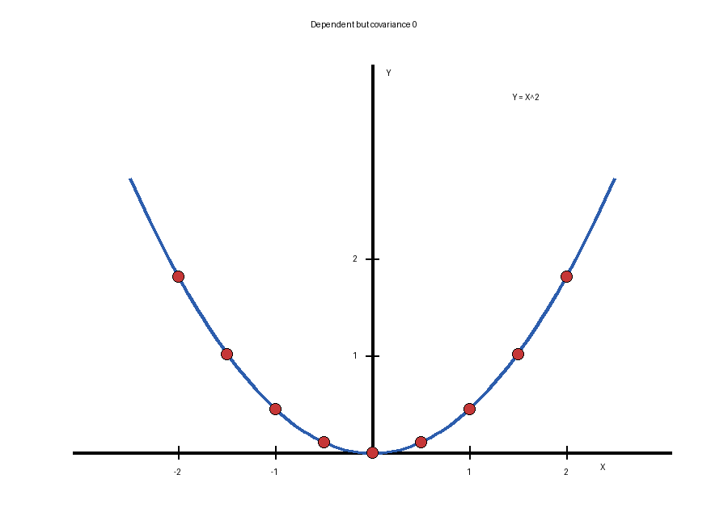

# Stat 110 (Blitzstein) — Lecture 21

**Lecture 21:** [Covariance and Correlation](https://www.youtube.com/watch?v=IujCYxtpszU&list=PL2SOU6wwxB0uwwH80KTQ6ht66KWxbzTIo&index=21)  
**Course:** Statistics 110 (Harvard) — Prof. Joe Blitzstein

---

## 1) Covariance: definition

The covariance of two random variables $X,Y$ is

$$
\boxed{\mathrm{Cov}(X,Y)=\mathbb{E}\big[(X-\mathbb{E}[X])(Y-\mathbb{E}[Y])\big].}
$$

This measures how $X$ and $Y$ vary together around their means.

Expanding the product gives the standard alternative formula:

$$
\begin{aligned}
\mathrm{Cov}(X,Y)
&= \mathbb{E}\big[(X-\mathbb{E}[X])(Y-\mathbb{E}[Y])\big] \\
&= \mathbb{E}\big[XY - X\mathbb{E}[Y] - \mathbb{E}[X]Y + \mathbb{E}[X]\mathbb{E}[Y]\big] \\
&= \mathbb{E}[XY] - \mathbb{E}[X]\mathbb{E}[Y] - \mathbb{E}[X]\mathbb{E}[Y] + \mathbb{E}[X]\mathbb{E}[Y] \\
&= \boxed{\mathbb{E}[XY]-\mathbb{E}[X]\mathbb{E}[Y].}
\end{aligned}
$$

---

## 2) Basic covariance properties

### (1) Covariance with itself is variance

$$
\boxed{\mathrm{Cov}(X,X)=\mathrm{Var}(X).}
$$

### (2) Symmetry

$$
\boxed{\mathrm{Cov}(X,Y)=\mathrm{Cov}(Y,X).}
$$

### (3) Covariance with a constant

If $c$ is a constant, then

$$
\boxed{\mathrm{Cov}(X,c)=0.}
$$

### (4) Pull out constants

$$
\boxed{\mathrm{Cov}(cX,Y)=c\,\mathrm{Cov}(X,Y).}
$$

Similarly,

$$
\mathrm{Cov}(X,cY)=c\,\mathrm{Cov}(X,Y).
$$

### (5) Additivity in one slot

$$
\boxed{\mathrm{Cov}(X,Y+Z)=\mathrm{Cov}(X,Y)+\mathrm{Cov}(X,Z).}
$$

These properties together give **bilinearity**.

---

## 3) Bilinearity

Using additivity and the constant-pullout rule:

$$
\boxed{
\mathrm{Cov}(X+Y,\ Z+W)
=
\mathrm{Cov}(X,Z)+\mathrm{Cov}(X,W)+\mathrm{Cov}(Y,Z)+\mathrm{Cov}(Y,W).
}
$$

More generally,

$$
\boxed{
\mathrm{Cov}\!\left(\sum_{i=1}^{m} a_i X_i,\ \sum_{j=1}^{n} b_j Y_j\right)
=
\sum_{i=1}^{m}\sum_{j=1}^{n} a_i b_j\,\mathrm{Cov}(X_i,Y_j).
}
$$

---

## 4) Variance of sums

For two random variables,

$$
\boxed{
\mathrm{Var}(X_1+X_2)
=
\mathrm{Var}(X_1)+\mathrm{Var}(X_2)+2\,\mathrm{Cov}(X_1,X_2).
}
$$

Special case: if $X_1$ and $X_2$ are independent, then $\mathrm{Cov}(X_1,X_2)=0$, so

$$
\mathrm{Var}(X_1+X_2)=\mathrm{Var}(X_1)+\mathrm{Var}(X_2).
$$

For $n$ random variables,

$$
\boxed{
\mathrm{Var}(X_1+\cdots+X_n)
=
\mathrm{Var}(X_1)+\cdots+\mathrm{Var}(X_n)
+
2\sum_{i<j}\mathrm{Cov}(X_i,X_j).
}
$$

---

## 5) Independence implies uncorrelated, but not conversely

### Theorem

If $X$ and $Y$ are independent, then they are uncorrelated:

$$
\boxed{\mathrm{Cov}(X,Y)=0.}
$$

Reason:

$$
\mathrm{Cov}(X,Y)=\mathbb{E}[XY]-\mathbb{E}[X]\mathbb{E}[Y],
$$

and if $X,Y$ are independent then

$$
\mathbb{E}[XY]=\mathbb{E}[X]\mathbb{E}[Y].
$$

### Converse is false

Take

$$
Z\sim N(0,1),\qquad X=Z,\qquad Y=Z^2.
$$

Then

$$
\mathrm{Cov}(X,Y)
=
\mathbb{E}[XY]-\mathbb{E}[X]\mathbb{E}[Y]
=
\mathbb{E}[Z^3]-\mathbb{E}[Z]\mathbb{E}[Z^2].
$$

Now $\mathbb{E}[Z]=0$ by symmetry, and $\mathbb{E}[Z^3]=0$ as an odd moment of a standard normal, so

$$
\boxed{\mathrm{Cov}(X,Y)=0.}
$$

But $Y$ is a function of $X$:

$$
Y=X^2.
$$

So they are very dependent. In fact, $Y$ determines the magnitude of $X$.

- 

---

## 6) Correlation

The correlation of $X$ and $Y$ is

$$
\boxed{
\mathrm{Corr}(X,Y)
=
\frac{\mathrm{Cov}(X,Y)}{\mathrm{SD}(X)\,\mathrm{SD}(Y)}.
}
$$

This is often denoted by $\rho$:

$$
\rho=\mathrm{Corr}(X,Y).
$$

Equivalent standardized form:

$$
\boxed{
\mathrm{Corr}(X,Y)
=
\mathrm{Cov}\!\left(
\frac{X-\mathbb{E}[X]}{\mathrm{SD}(X)},
\frac{Y-\mathbb{E}[Y]}{\mathrm{SD}(Y)}
\right).
}
$$

So correlation is the covariance of the standardized variables.

---

## 7) Correlation is always between -1 and 1

### Theorem

$$
\boxed{-1\le \mathrm{Corr}(X,Y)\le 1.}
$$

### Proof idea

WLOG, assume $X$ and $Y$ are standardized:

$$
\mathbb{E}[X]=\mathbb{E}[Y]=0,
\qquad
\mathrm{Var}(X)=\mathrm{Var}(Y)=1.
$$

Let

$$
\rho=\mathrm{Corr}(X,Y)=\mathrm{Cov}(X,Y).
$$

Then

$$
0\le \mathrm{Var}(X+Y)
=
\mathrm{Var}(X)+\mathrm{Var}(Y)+2\mathrm{Cov}(X,Y)
=
2+2\rho.
$$

So

$$
\rho\ge -1.
$$

Also,

$$
0\le \mathrm{Var}(X-Y)
=
\mathrm{Var}(X)+\mathrm{Var}(Y)-2\mathrm{Cov}(X,Y)
=
2-2\rho.
$$

So

$$
\rho\le 1.
$$

Combining both:

$$
\boxed{-1\le \rho\le 1.}
$$

---

## 8) Example: covariance in a multinomial

Suppose

$$
(X_1,\dots,X_k)\sim \mathrm{Mult}(n,\mathbf{p}),
$$

where $\mathbf{p}=(p_1,\dots,p_k)$ and we want $\mathrm{Cov}(X_i,X_j)$ for all $i,j$.

### Case 1: $i=j$

Then

$$
\mathrm{Cov}(X_i,X_i)=\mathrm{Var}(X_i).
$$

Since each coordinate is Binomial$(n,p_i)$ marginally,

$$
\boxed{\mathrm{Var}(X_i)=n p_i(1-p_i).}
$$

### Case 2: $i\ne j$

Compute one representative case, say $\mathrm{Cov}(X_1,X_2)$.

Because $X_1+X_2$ counts how many trials fall in category 1 or 2,

$$
X_1+X_2 \sim \mathrm{Bin}(n,p_1+p_2).
$$

So

$$
\mathrm{Var}(X_1+X_2)=n(p_1+p_2)\big(1-(p_1+p_2)\big).
$$

But also,

$$
\mathrm{Var}(X_1+X_2)
=
\mathrm{Var}(X_1)+\mathrm{Var}(X_2)+2\,\mathrm{Cov}(X_1,X_2).
$$

Substitute the Binomial variances:

$$
\begin{aligned}
n(p_1+p_2)\big(1-(p_1+p_2)\big)
&=
n p_1(1-p_1)+n p_2(1-p_2)+2\,\mathrm{Cov}(X_1,X_2).
\end{aligned}
$$

Solving gives

$$
\boxed{\mathrm{Cov}(X_1,X_2)=-n p_1 p_2.}
$$

Therefore, in general,

$$
\boxed{
\mathrm{Cov}(X_i,X_j)=
\begin{cases}
n p_i(1-p_i), & i=j,\\
-n p_i p_j, & i\ne j.
\end{cases}
}
$$

The off-diagonal covariances are negative because the category counts compete with each other.

---

## 9) Example: Binomial variance via indicators

Let

$$
X\sim \mathrm{Bin}(n,p),
$$

and write

$$
X=X_1+\cdots+X_n,
$$

where $X_j$ are i.i.d. Bernoulli$(p)$.

If $I_A$ is the indicator random variable of an event $A$, then

$$
I_A^2=I_A,\qquad I_A^3=I_A,
$$

and

$$
I_A I_B = I_{A\cap B}.
$$

For a Bernoulli random variable $X_j$,

$$
\mathrm{Var}(X_j)
=
\mathbb{E}[X_j^2]-(\mathbb{E}[X_j])^2
=
p-p^2
=
p(1-p).
$$

If we write $q=1-p$, then

$$
\mathrm{Var}(X_j)=pq.
$$

Since the $X_j$ are independent,

$$
\mathrm{Cov}(X_i,X_j)=0\qquad \text{for }i\ne j.
$$

Therefore,

$$
\boxed{\mathrm{Var}(X)=npq.}
$$

---

## 10) Example: Hypergeometric via indicators

Let

$$
X\sim \mathrm{HGeom}(w,b,n),
$$

where there are $w$ white balls, $b$ black balls, and we sample $n$ balls without replacement.

Write

$$
X=X_1+\cdots+X_n,
$$

where

$$
X_j=
\begin{cases}
1, & \text{if the $j$th ball is white},\\
0, & \text{otherwise.}
\end{cases}
$$

By symmetry,

$$
\mathrm{Var}(X)
=
n\,\mathrm{Var}(X_1)+2\binom{n}{2}\mathrm{Cov}(X_1,X_2).
$$

Now

$$
\mathrm{Cov}(X_1,X_2)
=
\mathbb{E}[X_1X_2]-\mathbb{E}[X_1]\mathbb{E}[X_2].
$$

Compute each term:

$$
\mathbb{E}[X_1]=\mathbb{P}(X_1=1)=\frac{w}{w+b},
$$

and similarly $\mathbb{E}[X_2]=\frac{w}{w+b}$.

Also,

$$
\mathbb{E}[X_1X_2]
=
\mathbb{P}(X_1=1,\ X_2=1)
=
\frac{w}{w+b}\cdot \frac{w-1}{w+b-1}.
$$

So

$$
\mathrm{Cov}(X_1,X_2)
=
\frac{w}{w+b}\cdot \frac{w-1}{w+b-1}
-
\left(\frac{w}{w+b}\right)^2.
$$

Let $N=w+b$. Then

$$
\mathrm{Cov}(X_1,X_2)
=
\frac{w(w-1)}{N(N-1)}-\frac{w^2}{N^2}
=
\frac{w(w-N)}{N^2(N-1)}
=
-\frac{wb}{N^2(N-1)}.
$$

Also,

$$
\mathrm{Var}(X_1)
=
\frac{w}{N}\left(1-\frac{w}{N}\right)
=
\frac{wb}{N^2}.
$$

Therefore,

$$
\begin{aligned}
\mathrm{Var}(X)
&=
n\frac{wb}{N^2}
+
2\binom{n}{2}\left(-\frac{wb}{N^2(N-1)}\right) \\
&=
\frac{nwb}{N^2}
-\frac{n(n-1)wb}{N^2(N-1)} \\
&=
\frac{nwb}{N^2}\left(1-\frac{n-1}{N-1}\right) \\
&=
\boxed{
\frac{nwb}{(w+b)^2}\cdot \frac{w+b-n}{w+b-1}.
}
\end{aligned}
$$

So sampling without replacement creates negative covariance between draws, which is exactly the finite-population correction factor.
