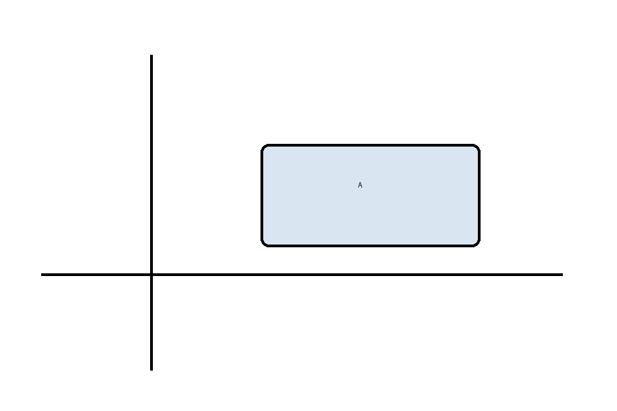
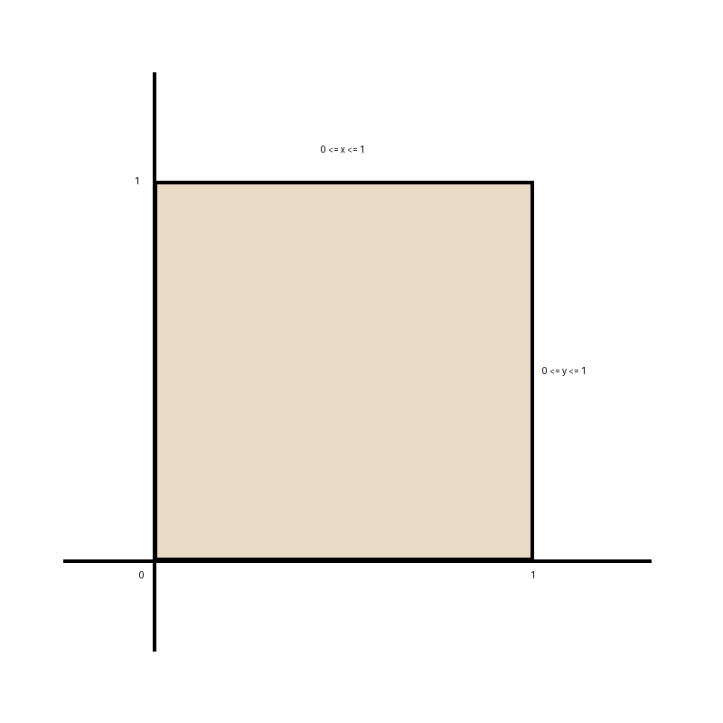
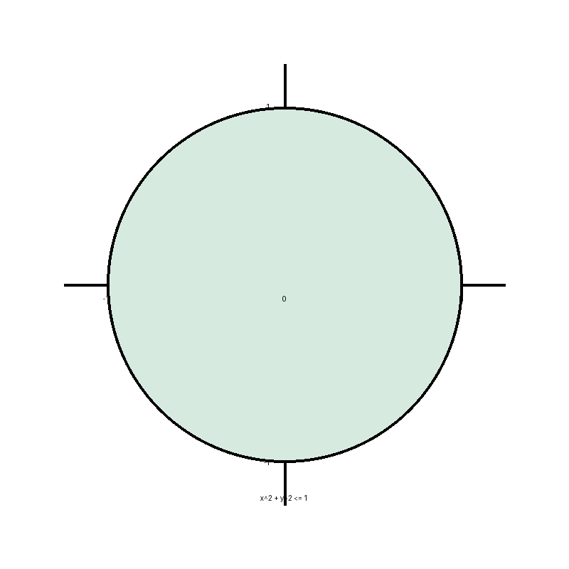
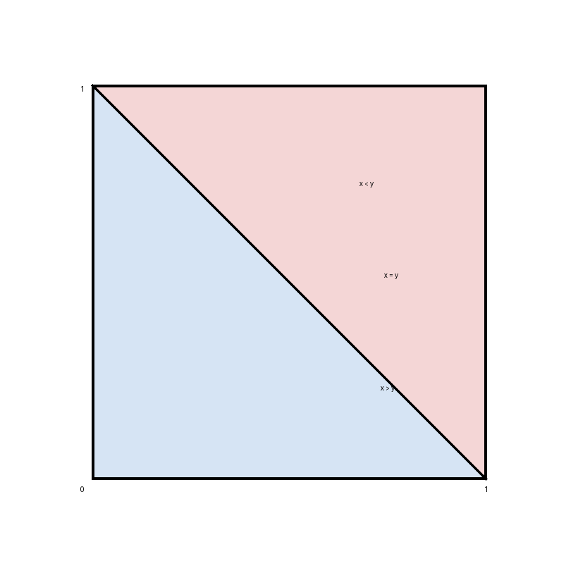

# Stat 110 (Blitzstein) — Lecture 19

**Lecture 19:** [Joint, Conditional, and Marginal Distributions](https://www.youtube.com/watch?v=J70dP_AECzQ&list=PL2SOU6wwxB0uwwH80KTQ6ht66KWxbzTIo&index=19)  
**Course:** Statistics 110 (Harvard) — Prof. Joe Blitzstein

---

## 1) Joint distributions: CDF, PMF, and PDF

For two random variables $X,Y$:

### Joint CDF

$$
\boxed{F(x,y)=\mathbb{P}(X\le x,\ Y\le y).}
$$

### Discrete joint PMF

If $X,Y$ are discrete,

$$
\boxed{p_{X,Y}(x,y)=\mathbb{P}(X=x,\ Y=y).}
$$

### Continuous joint PDF

If $X,Y$ are continuous with joint density $f_{X,Y}$, then

$$
\boxed{f_{X,Y}(x,y)=\frac{\partial^2}{\partial x\,\partial y}F(x,y).}
$$

And for any region $A$ in the plane,

$$
\boxed{\mathbb{P}\big((X,Y)\in A\big)=\iint_A f_{X,Y}(x,y)\,dx\,dy.}
$$

- 

As always, total probability must be 1:

$$
\boxed{\iint_{-\infty}^{\infty} f_{X,Y}(x,y)\,dx\,dy=1.}
$$

---

## 2) Marginal distributions

The marginal distribution of one variable is obtained by "integrating out" or "summing out" the other variable.

### Discrete case

$$
\boxed{\mathbb{P}(X=x)=\sum_y \mathbb{P}(X=x,\ Y=y).}
$$

Similarly,

$$
\boxed{\mathbb{P}(Y=y)=\sum_x \mathbb{P}(X=x,\ Y=y).}
$$

### Continuous case

$$
\boxed{f_X(x)=\int_{-\infty}^{\infty} f_{X,Y}(x,y)\,dy}
$$

and

$$
\boxed{f_Y(y)=\int_{-\infty}^{\infty} f_{X,Y}(x,y)\,dx.}
$$

For CDFs, the marginal CDF of $X$ is

$$
\boxed{F_X(x)=\mathbb{P}(X\le x),}
$$

and similarly for $Y$.

---

## 3) A simple discrete example: Bernoulli table

Take a simple joint distribution where $X,Y\in\{0,1\}$ and the joint PMF is:

|        | $y=0$ | $y=1$ | Row sum |
| ------ | ----- | ----- | ------- |
| $x=0$  | $2/6$ | $1/6$ | $3/6$   |
| $x=1$  | $2/6$ | $1/6$ | $3/6$   |
| Col sum | $4/6$ | $2/6$ | $1$ |

So the marginals are:

$$
\mathbb{P}(X=0)=\mathbb{P}(X=1)=\frac{3}{6},
\qquad
\mathbb{P}(Y=0)=\frac{4}{6},\quad \mathbb{P}(Y=1)=\frac{2}{6}.
$$

Check one entry:

$$
\mathbb{P}(X=0)\mathbb{P}(Y=0)=\frac{3}{6}\cdot\frac{4}{6}=\frac{12}{36}=\frac{2}{6}
=\mathbb{P}(X=0,Y=0).
$$

Likewise,

$$
\mathbb{P}(X=0)\mathbb{P}(Y=1)=\frac{3}{6}\cdot\frac{2}{6}=\frac{1}{6},
$$

and the same works for the other two entries, so here $X$ and $Y$ are independent.

---

## 4) Independence

For two random variables $X,Y$:

### CDF characterization

$$
\boxed{F(x,y)=F_X(x)F_Y(y)\quad \text{for all }x,y}
$$

means that $X$ and $Y$ are independent.

### Discrete characterization

$$
\boxed{\mathbb{P}(X=x,\ Y=y)=\mathbb{P}(X=x)\mathbb{P}(Y=y)\quad \text{for all }x,y.}
$$

### Continuous characterization

$$
\boxed{f_{X,Y}(x,y)=f_X(x)f_Y(y)\quad \text{for all }x,y.}
$$

Later consequence:

$$
\boxed{\text{independence} \implies \text{uncorrelated}.}
$$

Also, if $X$ and $Y$ are independent, then conditioning on one does not change the other:

$$
f_{Y\mid X}(y\mid x)=f_Y(y).
$$

---

## 5) Conditional density

When $X,Y$ are continuous and $f_X(x)>0$,

$$
\boxed{f_{Y\mid X}(y\mid x)=\frac{f_{X,Y}(x,y)}{f_X(x)}.}
$$

Using Bayes-style rearrangement,

$$
\boxed{f_{Y\mid X}(y\mid x)=\frac{f_{X\mid Y}(x\mid y)\,f_Y(y)}{f_X(x)}.}
$$

This is the continuous analogue of conditional probability.

---

## 6) Example: Uniform on the unit square

Let $(X,Y)$ be uniform on the square

$$
\{(x,y): 0\le x\le 1,\ 0\le y\le 1\}.
$$

Then the joint PDF is constant on the square and 0 outside:

$$
f_{X,Y}(x,y)=
\begin{cases}
c, & 0\le x\le 1,\ 0\le y\le 1,\\
0, & \text{otherwise.}
\end{cases}
$$

Since the integral of the density is area times height,

$$
c=\frac{1}{\text{area}}=\frac{1}{1}=1.
$$

So

$$
f_{X,Y}(x,y)=
\begin{cases}
1, & 0\le x\le 1,\ 0\le y\le 1,\\
0, & \text{otherwise.}
\end{cases}
$$

- 

Now compute a marginal:

$$
f_X(x)=\int_0^1 1\,dy=1,\qquad 0\le x\le 1.
$$

Similarly,

$$
f_Y(y)=1,\qquad 0\le y\le 1.
$$

Hence marginally,

$$
X\sim \text{Unif}(0,1),\qquad Y\sim \text{Unif}(0,1),
$$

and in fact

$$
f_{X,Y}(x,y)=f_X(x)f_Y(y),
$$

so $X$ and $Y$ are independent.

---

## 7) Example: Uniform on the unit disk

Let $(X,Y)$ be uniform on the disk

$$
x^2+y^2\le 1.
$$

Then the joint PDF is

$$
f_{X,Y}(x,y)=
\begin{cases}
\frac{1}{\pi}, & x^2+y^2\le 1,\\
0, & \text{otherwise.}
\end{cases}
$$

because the area of the unit disk is $\pi$.

- 

This is not like the square case: $X$ and $Y$ are dependent.

To find the marginal of $X$, for fixed $x$ the allowed $y$ values satisfy

$$
y^2\le 1-x^2
\quad \Longrightarrow \quad
-\sqrt{1-x^2}\le y\le \sqrt{1-x^2}.
$$

So

$$
f_X(x)
=
\int_{-\sqrt{1-x^2}}^{\sqrt{1-x^2}} \frac{1}{\pi}\,dy
=
\frac{2}{\pi}\sqrt{1-x^2},
\qquad -1\le x\le 1.
$$

This is **not uniform**.

Now compute the conditional density:

$$
f_{Y\mid X}(y\mid x)
=
\frac{f_{X,Y}(x,y)}{f_X(x)}
=
\frac{1/\pi}{(2/\pi)\sqrt{1-x^2}}
=
\frac{1}{2\sqrt{1-x^2}},
$$

for

$$
-\sqrt{1-x^2}\le y\le \sqrt{1-x^2}.
$$

So

$$
\boxed{Y\mid X=x \sim \text{Unif}\!\left(-\sqrt{1-x^2},\ \sqrt{1-x^2}\right).}
$$

That is, once $X=x$ is fixed, $Y$ is uniform on the vertical slice through the disk.

Therefore,

$$
f_{X,Y}(x,y)\ne f_X(x)f_Y(y),
$$

so $X$ and $Y$ are not independent.

---

## 8) 2-D LOTUS

Let $(X,Y)$ have joint PDF $f(x,y)$, and let $g(x,y)$ be a real-valued function of $X,Y$.

Then

$$
\boxed{\mathbb{E}[g(X,Y)] = \iint_{-\infty}^{\infty} g(x,y)\,f(x,y)\,dx\,dy.}
$$

This is the 2-dimensional version of LOTUS.

### Theorem: if $X,Y$ are independent, then $\mathbb{E}[XY]=\mathbb{E}[X]\mathbb{E}[Y]$

In the continuous case,

$$
\mathbb{E}[XY]
=
\iint xy\,f_X(x)f_Y(y)\,dx\,dy.
$$

Rearrange:

$$
\mathbb{E}[XY]
=
\int_{-\infty}^{\infty}
y f_Y(y)
\left(
\int_{-\infty}^{\infty} x f_X(x)\,dx
\right)dy.
$$

But

$$
\int_{-\infty}^{\infty} x f_X(x)\,dx = \mathbb{E}[X],
$$

so

$$
\mathbb{E}[XY]
=
\mathbb{E}[X]\int_{-\infty}^{\infty} y f_Y(y)\,dy
=
\mathbb{E}[X]\mathbb{E}[Y].
$$

Hence independence implies

$$
\mathrm{Cov}(X,Y)=0,
$$

so independent random variables are uncorrelated.

---

## 9) Example: $X,Y\overset{\text{iid}}{\sim}\text{Unif}(0,1)$, find $\mathbb{E}|X-Y|$

By 2-D LOTUS,

$$
\mathbb{E}|X-Y|
=
\int_0^1\int_0^1 |x-y|\,dx\,dy.
$$

Split the square into the two triangles above and below the diagonal:

$$
\int_0^1\int_0^1 |x-y|\,dx\,dy
=
\iint_{x>y} (x-y)\,dx\,dy
+
\iint_{x<y} (y-x)\,dx\,dy.
$$

By symmetry,

$$
=
2\iint_{x>y} (x-y)\,dx\,dy
=
2\int_0^1\int_0^x (x-y)\,dy\,dx.
$$

- 

Compute the inner integral:

$$
\int_0^x (x-y)\,dy
=
\left[xy-\frac{y^2}{2}\right]_{0}^{x}
=
\frac{x^2}{2}.
$$

So

$$
\mathbb{E}|X-Y|
=
2\int_0^1 \frac{x^2}{2}\,dx
=
\int_0^1 x^2\,dx
=
\frac{1}{3}.
$$

Therefore,

$$
\boxed{\mathbb{E}|X-Y|=\frac{1}{3}.}
$$

Now define

$$
M=\max(X,Y),\qquad L=\min(X,Y).
$$

Then

$$
|X-Y|=M-L.
$$

So

$$
\mathbb{E}(M-L)=\frac{1}{3}=\mathbb{E}(M)-\mathbb{E}(L).
$$

Also,

$$
\mathbb{E}(M+L)=\mathbb{E}(X+Y)=\mathbb{E}(X)+\mathbb{E}(Y)=1.
$$

Solving

$$
\mathbb{E}(M)-\mathbb{E}(L)=\frac{1}{3},
\qquad
\mathbb{E}(M)+\mathbb{E}(L)=1,
$$

gives

$$
\boxed{\mathbb{E}(M)=\frac{2}{3},\qquad \mathbb{E}(L)=\frac{1}{3}.}
$$

---

## 10) Example: Chicken-and-egg splitting for a Poisson random variable

Let

$$
N\sim \mathrm{Pois}(\lambda)
$$

be the number of eggs, and suppose each egg hatches independently with probability $p$.

Let

$$
X=\text{\# that hatch},\qquad Y=\text{\# that do not hatch},\qquad q=1-p.
$$

Then

$$
X+Y=N,
$$

and conditional on $N$,

$$
X\mid N \sim \mathrm{Bin}(N,p).
$$

We want the joint PMF of $X,Y$.

For integers $i,j\ge 0$, use the law of total probability:

$$
\mathbb{P}(X=i,Y=j)
=
\sum_{n=0}^{\infty}
\mathbb{P}(X=i,Y=j\mid N=n)\mathbb{P}(N=n).
$$

But $X=i$ and $Y=j$ force $N=i+j$, so only one term survives:

$$
\mathbb{P}(X=i,Y=j)
=
\mathbb{P}(X=i,Y=j\mid N=i+j)\mathbb{P}(N=i+j).
$$

Given $N=i+j$, the event $Y=j$ is redundant once $X=i$ is known, since $X+Y=N$. Thus

$$
\mathbb{P}(X=i,Y=j\mid N=i+j)
=
\mathbb{P}(X=i\mid N=i+j).
$$

Now use the Binomial and Poisson formulas:

$$
\mathbb{P}(X=i\mid N=i+j)
=
\binom{i+j}{i}p^i q^j,
$$

and

$$
\mathbb{P}(N=i+j)=e^{-\lambda}\frac{\lambda^{i+j}}{(i+j)!}.
$$

Therefore,

$$
\mathbb{P}(X=i,Y=j)
=
\binom{i+j}{i}p^i q^j
\cdot
e^{-\lambda}\frac{\lambda^{i+j}}{(i+j)!}.
$$

Since

$$
\binom{i+j}{i}=\frac{(i+j)!}{i!\,j!},
$$

this becomes

$$
\mathbb{P}(X=i,Y=j)
=
\frac{(i+j)!}{i!\,j!}p^i q^j
\cdot
e^{-\lambda}\frac{\lambda^{i+j}}{(i+j)!}
=
\frac{(\lambda p)^i}{i!}\frac{(\lambda q)^j}{j!}e^{-\lambda}.
$$

Now split the exponential:

$$
e^{-\lambda}=e^{-\lambda p}e^{-\lambda q},
$$

so

$$
\mathbb{P}(X=i,Y=j)
=
\left(e^{-\lambda p}\frac{(\lambda p)^i}{i!}\right)
\left(e^{-\lambda q}\frac{(\lambda q)^j}{j!}\right).
$$

Thus the joint PMF factors:

$$
\boxed{\mathbb{P}(X=i,Y=j)=\mathbb{P}(X=i)\mathbb{P}(Y=j).}
$$

So

$$
\boxed{X\sim \mathrm{Pois}(\lambda p),\qquad Y\sim \mathrm{Pois}(\lambda q),}
$$

and $X,Y$ are independent.
