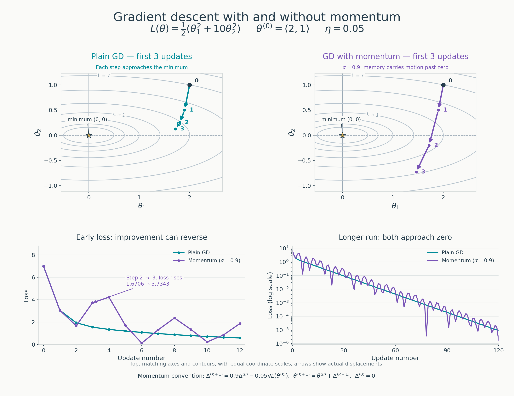

# Week 13 — Optimization Basics

**Status:** Week 13 in progress — Session 1 handwritten geometry and
understanding checkpoints reviewed on 2026-10-05.
Session 2 handwritten updates, recurrences, and step-size checkpoint
reviewed on 2026-10-06.
Session 3 momentum calculations and conceptual checkpoints reviewed on
2026-10-07.
Session 4 minibatch gradients, corruption noise, and the stochastic-step
checkpoint reviewed on 2026-10-08.

**Source basis:** The opening of MML §7.1, printed pages 227–228, checked
against the local study copy. See the [MML source catalog](../sources/mml/README.md)
and the [official book](https://mml-book.github.io/book/mml-book.pdf).
The momentum convention uses MML §7.1.2, equations 7.11–7.12 on printed
page 231, checked against the local copy during Session 3 setup.
Session 4 uses MML §7.1.3, printed pages 231–233, and the existing
[Week 8 training loop](../mini_projects/checkpoint_02_toy_score_matching/train.py),
checked during our review. The expectation derivations and stochastic-gradient
counterexample below are independent study examples.
The quadratic below is our practice objective. Its calculations and figure
are an independent consolidation of the handwritten work, not MML's worked
example or an official solution.

## Session 1 — Recover the Geometry of Gradient Descent

The question for today is: once a loss measures how well our model is doing,
what does its gradient tell us about changing the parameters?

### The Objective and Its Matrix Form

Let the parameter vector be a column vector and define

$$
\theta=
\begin{bmatrix}\theta_1\\\theta_2\end{bmatrix},
\qquad
A=
\begin{bmatrix}1&0\\0&10\end{bmatrix}.
$$

Our scalar loss is

$$
\begin{aligned}
L(\theta)
&=\frac12\theta^\top A\theta\\
&=\frac12
\begin{bmatrix}\theta_1&\theta_2\end{bmatrix}
\begin{bmatrix}\theta_1\\10\theta_2\end{bmatrix}\\
&=\frac12(\theta_1^2+10\theta_2^2)\\
&=\frac{\theta_1^2}{2}+5\theta_2^2.
\end{aligned}
$$

Both terms are nonnegative. The unique minimum is at $\theta=(0,0)^\top$,
where $L(\theta)=0$.

### Partial Derivatives, Row Derivative, and Column Gradient

Holding the other coordinate fixed gives

$$
\frac{\partial L}{\partial\theta_1}=\theta_1,
\qquad
\frac{\partial L}{\partial\theta_2}=10\theta_2.
$$

The handwritten row-vector calculation is valid in MML's convention:

$$
\frac{\partial L}{\partial\theta}
=\theta^\top A
=\begin{bmatrix}\theta_1&10\theta_2\end{bmatrix}.
$$

Following the [Week 10 convention](./w10_mml_multivariate_gaussian.md#gradient-convention),
we use $\nabla_\theta L$ for the **column gradient**:

$$
\nabla_\theta L
=\left(\frac{\partial L}{\partial\theta}\right)^\top
=A\theta
=\begin{bmatrix}\theta_1\\10\theta_2\end{bmatrix}.
$$

The equality with $A\theta$ uses the symmetry of $A$. The row and column
expressions contain the same partial derivatives; their shapes determine
how they enter a matrix product or a parameter update.

### The Total Differential

For an infinitesimal parameter displacement $d\theta$,

$$
\begin{aligned}
dL
&=\frac{\partial L}{\partial\theta}\,d\theta\\
&=(\nabla_\theta L)^\top d\theta\\
&=\theta^\top A\,d\theta\\
&=\begin{bmatrix}\theta_1&10\theta_2\end{bmatrix}
\begin{bmatrix}d\theta_1\\d\theta_2\end{bmatrix}\\
&=\theta_1\,d\theta_1+10\theta_2\,d\theta_2.
\end{aligned}
$$

In the handwritten intermediate line, the row multiplying $d\theta$ must
retain the factor $10$ in its second entry. The final expanded line was
already correct.

For a small finite displacement $\Delta\theta$, this differential gives the
first-order approximation

$$
L(\theta+\Delta\theta)-L(\theta)
\approx(\nabla_\theta L)^\top\Delta\theta.
$$

### Contours and Why One Direction Is Steeper

A contour contains parameter values with the same loss $L(\theta)=c$.
For $c>0$,

$$
\frac{\theta_1^2}{2}+5\theta_2^2=c
\quad\Longleftrightarrow\quad
\frac{\theta_1^2}{2c}+\frac{\theta_2^2}{c/5}=1.
$$

These are ellipses centered at the origin, with intercepts

$$
\theta_1=\pm\sqrt{2c}\quad(\theta_2=0),
\qquad
\theta_2=\pm\sqrt{c/5}\quad(\theta_1=0).
$$

The horizontal semi-axis is $\sqrt{10}$ times the vertical semi-axis.
At $c=0$, the contour reduces to the origin.


The ellipses are compressed vertically because the $\theta_2$ direction has
greater curvature:

$$
\frac{\partial^2 L}{\partial\theta_1^2}=1,
\qquad
\frac{\partial^2 L}{\partial\theta_2^2}=10.
$$

From the origin, equal-sized displacements along the two coordinate axes
produce ten times as much loss in the $\theta_2$ direction. More generally,
the local slopes are $\theta_1$ and $10\theta_2$: their relative size depends
on the current point. For example, the vertical slope is zero when
$\theta_2=0$, despite the greater vertical curvature.

At a point away from the origin, the gradient is perpendicular to the
contour and points toward the steepest local increase in loss, using
ordinary Euclidean distance. Its negative points toward the steepest local
decrease. This direction need not point directly at the origin.

### Loss, Gradient, Learning Rate, and Update

These are four different quantities:

| Quantity                                                     | Meaning                                                                                                                                                    |
| ------------------------------------------------------------ | ---------------------------------------------------------------------------------------------------------------------------------------------------------- |
| Loss $L(\theta)$                                             | A scalar measuring the objective at the current parameters.                                                                                                |
| Gradient $\nabla_\theta L(\theta)$                           | A vector of local rates of change; its orientation gives the steepest ascent direction and its norm gives the maximum directional slope per unit distance. |
| Learning rate $\eta$                                         | A positive scalar scaling the gradient in the update.                                                                                                      |
| Parameter update $\Delta\theta=-\eta\nabla_\theta L(\theta)$ | The actual displacement applied to the parameters.                                                                                                         |

Plain gradient descent uses the current gradient to form the next parameters:

$$
\theta_{k+1}=\theta_k-\eta\nabla_\theta L(\theta_k).
$$

The distance moved is $\|\Delta\theta\|_2=\eta\|\nabla_\theta L\|_2$.
The learning rate alone does not specify that distance.

Substituting the update into the first-order approximation gives

$$
L(\theta-\eta\nabla_\theta L)-L(\theta)
\approx-\eta\|\nabla_\theta L\|_2^2.
$$

At a point with a nonzero gradient, this explains why a sufficiently small
positive step decreases the loss. The approximation is local: a large step
can increase the loss. The coordinate recurrences and learning-rate
comparisons belong to Session 2.

### Parameter Gradient Versus Data-Space Score

In training, $\nabla_\theta L$ differentiates the training objective with
respect to **model parameters**. The optimizer changes those parameters to
reduce the objective.

The score from Week 10 is

$$
s(x)=\nabla_x\log p(x).
$$

It differentiates a log-density with respect to the **data coordinates**,
holding the distribution fixed. It points toward the steepest local
increase in log-density in data space.

For noisy data, the relevant density is $p_\sigma(x)$, the distribution at
noise level $\sigma$. Its score is $\nabla_x\log p_\sigma(x)$, with the noise
level held fixed while differentiating with respect to $x$.

For a score network $s_\theta(x)$, the network output is a vector in data
space. Training still uses $\nabla_\theta L$ to adjust its parameters so
that those outputs approximate the target score. The output score and the
gradient used by the optimizer play different roles and generally have
different dimensions.

### Reviewed Example

At $\theta=(2,1)^\top$, the loss and gradient are

$$
L(2,1)=\frac12(2^2+10\cdot1^2)=7,
\qquad
\nabla_\theta L(2,1)=\begin{bmatrix}2\\10\end{bmatrix}.
$$

The scalar loss identifies the contour; the gradient gives the local rates
of change. A learning rate is also needed to compute the parameter
displacement. MML calls it $\gamma$; these notes use $\eta$.

The direction straight toward the minimum is $(-2,-1)^\top$, while the
negative gradient is $(-2,-10)^\top$. The greater curvature along
$\theta_2$ makes reducing that coordinate more effective locally. Steepest
descent describes the greatest local loss decrease among infinitesimal
moves of equal Euclidean length.

### Understanding Checkpoints

Reviewed together on 2026-10-05:

- [x] Recover the matrix form, partial derivatives, and differential from the
      scalar objective.
- [x] Explain the ellipse intercepts and the greater curvature along $\theta_2$.
- [x] Distinguish the loss value, gradient direction, learning rate, and actual
      parameter displacement.
- [x] Distinguish a parameter gradient $\nabla_\theta L$ from a data-space score
      $\nabla_x\log p(x)$.

## Session 2 — Learning Rate and Curvature

The first two gradient-descent updates, coordinate recurrences, and
predictions for $\eta=0.05$, $0.15$, and $0.25$ are consolidated in the
[optimizer-update proof write-up](../proofs/w13_optimizer_updates.md#1-gradient-descent-on-the-practice-quadratic).

For this quadratic, the update multiplies the coordinates by $1-\eta$ and
$1-10\eta$. The learning rate therefore interacts differently with the
curvature of each direction. Sign changes describe oscillation; the absolute
values of the multipliers determine whether its amplitude shrinks or grows.

The negative gradient describes a local downhill direction. With
$\eta=0.25$, the first update moves $\theta_2$ from $1$ to $-1.5$: it crosses
zero and lands farther away, increasing that coordinate's loss contribution.
The total loss rises from $7$ to $12.375$.

Crossing zero can still improve the loss. With $\eta=0.15$, $\theta_2$ moves
from $1$ to $-0.5$, closer to zero. The distinction is how far the step lands
beyond the minimum. The recurrences give the convergence range
$0<\eta<0.2$ for this quadratic from our starting point.

**Checkpoint reviewed on 2026-10-06:** Explain why moving in the negative-gradient
direction can still increase the loss when the step is too large.

## Session 3 — Give the Optimizer Memory: Momentum

The handwritten momentum rule, initialization, first two updates,
additional third update, and comparison with plain gradient descent are
consolidated in the
[momentum proof section](../proofs/w13_optimizer_updates.md#2-gradient-descent-with-momentum).

The chosen convention stores the previous parameter displacement:

$$
\begin{aligned}
\Delta^{(k+1)}&=\alpha\Delta^{(k)}-\eta\nabla_\theta L\bigl(\theta^{(k)}\bigr),\\
\theta^{(k+1)}&=\theta^{(k)}+\Delta^{(k+1)}.
\end{aligned}
$$

For the hand calculations, $\theta^{(0)}=(2,1)^\top$,
$\Delta^{(0)}=(0,0)^\top$, $\eta=0.05$, and $\alpha=0.9$.

### Comparing MML with Andrew Ng's Momentum Convention

The screenshot supplied during our 2026-10-07 review shows Andrew Ng's
[momentum lecture](https://www.youtube.com/watch?v=k8fTYJPd3_I) using an
exponential moving average of gradients. The equations below transcribe
that visible convention into our vector notation; the equivalence
derivation is our independent check, rather than a transcript of the full
video.

Andrew's $\alpha$ denotes the **learning rate**, while MML's $\alpha$
denotes the **momentum coefficient**. To avoid this collision, write
Andrew's learning rate as $\eta_{\mathrm{Ng}}$:

$$
\begin{aligned}
v^{(k+1)}&=\beta v^{(k)}+(1-\beta)g^{(k)},\\
\theta^{(k+1)}&=\theta^{(k)}-\eta_{\mathrm{Ng}}v^{(k+1)},
\qquad g^{(k)}=\nabla_\theta L\bigl(\theta^{(k)}\bigr).
\end{aligned}
$$

Here $v$ stores a smoothed gradient, whereas our $\Delta$ stores the signed
parameter displacement. With a constant learning rate, define

$$
\Delta^{(k)}=-\eta_{\mathrm{Ng}}v^{(k)}.
$$

Multiplying the moving-average rule by $-\eta_{\mathrm{Ng}}$ gives

$$
\begin{aligned}
\Delta^{(k+1)}
&=\beta\Delta^{(k)}-\eta_{\mathrm{Ng}}(1-\beta)g^{(k)}\\
&=\alpha_{\mathrm{MML}}\Delta^{(k)}-\eta_{\mathrm{MML}}g^{(k)}.
\end{aligned}
$$

Thus the conventions produce identical parameter updates when

$$
\boxed{\alpha_{\mathrm{MML}}=\beta,
\qquad \eta_{\mathrm{MML}}=(1-\beta)\eta_{\mathrm{Ng}}.}
$$

| Role                 | Andrew Ng's slide                           | MML / our hand calculations     |
| -------------------- | ------------------------------------------- | ------------------------------- |
| Momentum coefficient | $\beta$                                     | $\alpha$                        |
| Learning rate        | $\alpha$, renamed $\eta_{\mathrm{Ng}}$ here | $\gamma$ in MML, $\eta$ here    |
| Stored state         | Smoothed gradient $v$                       | Parameter displacement $\Delta$ |

The factor $1-\beta$ is absorbed into the **learning rate**, not MML's
momentum coefficient $\alpha$. It normalizes the gradient weights: for a
constant gradient and zero initial state, $v$ approaches that gradient
when $0\leq\beta<1$.

For our $\alpha_{\mathrm{MML}}=0.9$ and $\eta_{\mathrm{MML}}=0.05$,
the equivalent settings are $\beta=0.9$ and
$\eta_{\mathrm{Ng}}=0.05/(1-0.9)=0.5$. With $v^{(0)}=0$, the first
smoothed gradient is $(0.2,1)^\top$, giving the same displacement
$(-0.1,-0.5)^\top$ and the same next point $(1.9,0.5)^\top$.

Using $0.05$ as Andrew's learning rate instead would give the first point
$(1.99,0.95)^\top$. Equal numerical learning rates across these conventions
therefore do not produce equal trajectories.

This comparison assumes fixed coefficients, constant learning rates,
the same starting parameters, matched zero initial states, and the
displayed moving average without bias correction. It explains why we
write down a convention and its initialization before calculating updates.

### Memory and Motion in a Narrow Valley

The stored displacement already contains earlier contributions. Carrying
it forward therefore retains a decaying history of negative-gradient
contributions, rather than only the latest gradient.

- Consistently directed contributions can reinforce each other and build
  sustained motion along a valley.
- Alternating contributions across a valley can partially cancel and damp
  zigzagging. The gradient's sign still depends on the current location on
  the loss surface; momentum can delay the update's reversal.
- Retained motion can dominate the fresh contribution, so momentum still
  needs a suitable learning rate and momentum coefficient.

The extra third handwritten update illustrates the last point. In the
second coordinate, retained motion contributes $-0.63$ while current
descent contributes $+0.1$. Their sum is $-0.53$, moving $\theta_2$ from
$-0.2$ to $-0.73$, farther from zero. Total loss increases from about
$1.6706$ to $3.7343$.

The learning rate $\eta$ and memory coefficient $\alpha$ must be considered
together. An individual loss increase does not establish divergence: an
independent recurrence check in the proof confirms that our chosen pair
still converges eventually on this quadratic.

### Visual Comparison with Plain Gradient Descent



Both methods start at $(2,1)^\top$ and use $\eta=0.05$. Momentum uses our
displacement convention with $\alpha=0.9$ and $\Delta^{(0)}=0$. The top
panels show exactly the first three updates, using identical axes,
contours, and equal coordinate scales. The arrows are actual updates.

The bottom panels extend the calculation independently to 12 and 120
updates. Plain GD decreases the loss at every step here. Momentum initially
improves it, then raises it from $1.6706$ to $3.7343$ at update 3; later
oscillations decay. Both losses approach zero with these settings.

This example shows how memory changes the trajectory. It does not establish
that momentum always smooths motion or always reaches a lower loss than GD
at a given iteration. The settings are our hand-calculation choices, rather
than separately tuned choices for each optimizer.

**Checkpoints reviewed on 2026-10-07:** What momentum remembers, the effect
of agreeing or alternating gradients, why it can help in a narrow valley,
and why a suitable learning rate is still necessary.

## Session 4 — Where Stochastic Gradients Come From

### Fix the Dataset and Parameters Before Taking an Expectation

Suppose the training dataset contains $N$ examples, and $\ell_i(\theta)$
is the loss for example $i$. Write the full training loss as an average:

$$
L(\theta)=\frac1N\sum_{i=1}^{N}\ell_i(\theta),
\qquad
\nabla_\theta L(\theta)=\frac1N\sum_{i=1}^{N}\nabla_\theta\ell_i(\theta).
$$

MML equation 7.13 writes the objective as a sum. We use an average to make
the Monte Carlo connection explicit. The two objectives have the same
minimizers, but their gradients differ by a factor of $N$, which matters
when choosing a numerical learning rate.

Hold the dataset and current parameters $\theta$ fixed. Choose an index
$I$ uniformly from $\{1,\ldots,N\}$ and compute the random gradient
estimator $g_I=\nabla_\theta\ell_I(\theta)$. Its expectation is

$$
\begin{aligned}
\mathbb E_I[g_I]
&=\sum_{i=1}^{N}\frac1N\nabla_\theta\ell_i(\theta)\\
&=\nabla_\theta\left(\frac1N\sum_{i=1}^{N}\ell_i(\theta)\right)\\
&=\nabla_\theta L(\theta).
\end{aligned}
$$

The random quantity $g_I$ is an **unbiased estimator** of the full gradient.
Its expectation equals the full gradient; an individual draw can differ
in both magnitude and direction. The expectation itself is the target
average, rather than another random gradient estimate.

### Minibatches Connect SGD to Monte Carlo

For $m$ independently and uniformly sampled indices, average their gradients:

$$
\widehat g_B(\theta)=\frac1m\sum_{j=1}^{m}g_{I_j},
\qquad
\mathbb E[\widehat g_B(\theta)]=\nabla_\theta L(\theta).
$$

The stochastic update uses this estimate at the current parameter vector:

$$
\theta^{(k+1)}
=\theta^{(k)}-\eta\widehat g_B\bigl(\theta^{(k)}\bigr).
$$

This follows the same pattern as our earlier Monte Carlo area example:
sample random inputs, evaluate a quantity for each input, and average.
There, the indicator average estimates a hit probability; multiplying by
the rectangle's area estimates the region's area. Here, we average gradient
vectors to estimate the full gradient.

With independent draws and fixed $\theta$, the variance of any gradient
coordinate $r$ satisfies

$$
\operatorname{Var}(\widehat g_{B,r})
=\frac1{m^2}\sum_{j=1}^{m}\operatorname{Var}(g_{I_j,r})
=\frac{\operatorname{Var}(g_{I,r})}{m}.
$$

Larger batches give estimates more concentrated around the full gradient,
at greater computational cost. They do not guarantee that each particular
estimate is closer. This variance formula assumes sampling with replacement;
sampling a subset without replacement remains unbiased, but changes the
variance formula. Using every example once removes randomness from example
selection when no other randomness is present.

### Two Sources of Gradient Randomness

| Source           | What changes with parameters held fixed? | Effect on the estimated gradient                          |
| ---------------- | ---------------------------------------- | --------------------------------------------------------- |
| Data sampling    | Which clean examples enter the batch     | Different examples contribute different loss gradients    |
| Corruption noise | The noise added to each clean example    | Noisy inputs and, for the score objective, targets change |

The Week 8 score model uses the entire clean training set each iteration,
but draws fresh noise inside the loop:

```python
train_noise = torch.randn_like(train_x0)
train_xt = train_x0 + FORWARD_SIGMA * train_noise
target = -(train_xt - train_x0) / FORWARD_SIGMA**2
```

These are the score-branch expressions at lines 126–135 of the
[training loop](../mini_projects/checkpoint_02_toy_score_matching/train.py#L126).
For $x_t=x_0+\sigma\epsilon$, the conditional Gaussian score target is

$$
-\frac{x_t-x_0}{\sigma^2}=-\frac{\epsilon}{\sigma}.
$$

Different noise draws change the forward corruption, the loss, and its
parameter gradient. The gradients can therefore differ even if we hold
the clean dataset and model parameters fixed. Parameter changes during
training also change gradients, but are distinct from the randomness we
are isolating here.

To describe the full objective for this model, include the expectation
over corruption noise. Let $s_\theta$ be the score network and $d=2$ the
number of data coordinates. Its per-example loss is

$$
\ell_i(\theta,\epsilon)
=\frac1d\left\|s_\theta(x_i+\sigma\epsilon)
+\frac{\epsilon}{\sigma}\right\|_2^2,
\qquad \epsilon\sim\mathcal N(0,I_d).
$$

The factor $1/d$ matches the code's mean reduction over coordinate errors.
The objective and its sampled training estimate are

$$
\mathcal L(\theta)
=\frac1N\sum_{i=1}^{N}\mathbb E_\epsilon[\ell_i(\theta,\epsilon)],
\qquad
\widehat{\mathcal L}(\theta)
=\frac1N\sum_{i=1}^{N}\ell_i(\theta,\epsilon_i).
$$

Using every clean example does not evaluate the noise expectation exactly.
Fresh draws $\epsilon_i$ still make the gradient of the sampled loss random.
Under the usual conditions allowing differentiation through the expectation,
that gradient is unbiased for $\nabla_\theta\mathcal L(\theta)$.

### An Unbiased Gradient Can Produce an Uphill Step

Return to our practice quadratic at $\theta=(2,1)^\top$:

$$
L(\theta)=7,
\qquad
\nabla_\theta L(\theta)=\begin{bmatrix}2\\10\end{bmatrix}.
$$

For an independent thought experiment, let a random estimator return
$(2,-10)^\top$ or $(2,30)^\top$, each with probability $1/2$. It is unbiased:

$$
\mathbb E[\widehat g]
=\frac12\begin{bmatrix}2\\-10\end{bmatrix}
+\frac12\begin{bmatrix}2\\30\end{bmatrix}
=\begin{bmatrix}2\\10\end{bmatrix}.
$$

If the draw is $\widehat g=(2,-10)^\top$ and $\eta=0.05$, the update is

$$
\theta_{\mathrm{new}}
=\begin{bmatrix}2\\1\end{bmatrix}
-0.05\begin{bmatrix}2\\-10\end{bmatrix}
=\begin{bmatrix}1.9\\1.5\end{bmatrix},
\qquad
L(\theta_{\mathrm{new}})
=\frac12(1.9^2+10\cdot1.5^2)=13.055.
$$

The sampled gradient reverses the second component's sign, so the update
moves $\theta_2$ farther from zero. The full loss increases even though
$\eta=0.05$ was suitable for gradient descent using the full gradient.
This constructed estimator illustrates the issue; it is not a measured
gradient from the Week 8 model.

Our reviewed explanation is: **the estimator equals the full gradient on
average; individual draws can differ, including in direction, and can
produce an uphill step.** Unbiasedness guarantees neither a decrease at
every iteration nor convergence by itself. Learning rate, gradient
variability, and properties of the objective also matter.

### Session 4 Review Checkpoints

Reviewed together on 2026-10-08:

- [x] Explain why uniform sampling gives an unbiased estimate of the gradient of an average loss.
- [x] Connect minibatch averaging to Monte Carlo and explain the batch-size effect on variance.
- [x] Identify data sampling and corruption noise as two sources of gradient randomness.
- [x] Explain why the Week 8 full-batch training loop still has stochastic gradients.
- [x] Calculate and explain an individual stochastic step that increases the full objective.
