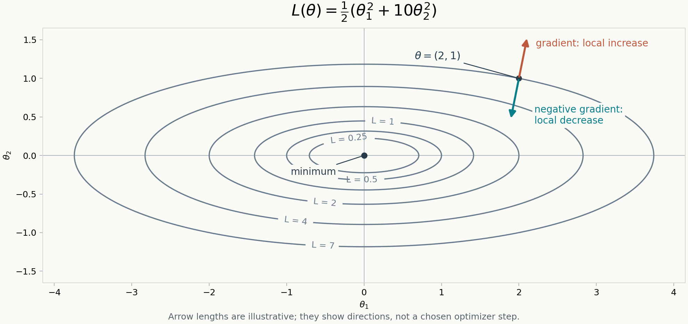

# Week 13 — Optimization Basics

**Status:** Week 13 in progress — Session 1 handwritten geometry and
understanding checkpoints reviewed on 2026-10-05.

**Source basis:** The opening of MML §7.1, printed pages 227–228, checked
against the local study copy. See the [MML source catalog](../sources/mml/README.md)
and the [official book](https://mml-book.github.io/book/mml-book.pdf).
The quadratic below is our practice objective. Its calculations and figure
are an independent consolidation of the handwritten work, not MML's worked
example or an official solution.

## Session 1 — Recover the Geometry of Gradient Descent

The question for today is: once a loss measures how well our model is doing,
what does its gradient tell us about changing the parameters?

### The Objective and Its Matrix Form

Let the parameter vector be a column vector and define

$$
\theta=
\begin{bmatrix}\theta_1\\\theta_2\end{bmatrix},
\qquad
A=
\begin{bmatrix}1&0\\0&10\end{bmatrix}.
$$

Our scalar loss is

$$
\begin{aligned}
L(\theta)
&=\frac12\theta^\top A\theta\\
&=\frac12
\begin{bmatrix}\theta_1&\theta_2\end{bmatrix}
\begin{bmatrix}\theta_1\\10\theta_2\end{bmatrix}\\
&=\frac12(\theta_1^2+10\theta_2^2)\\
&=\frac{\theta_1^2}{2}+5\theta_2^2.
\end{aligned}
$$

Both terms are nonnegative. The unique minimum is at $\theta=(0,0)^\top$,
where $L(\theta)=0$.

### Partial Derivatives, Row Derivative, and Column Gradient

Holding the other coordinate fixed gives

$$
\frac{\partial L}{\partial\theta_1}=\theta_1,
\qquad
\frac{\partial L}{\partial\theta_2}=10\theta_2.
$$

The handwritten row-vector calculation is valid in MML's convention:

$$
\frac{\partial L}{\partial\theta}
=\theta^\top A
=\begin{bmatrix}\theta_1&10\theta_2\end{bmatrix}.
$$

Following the [Week 10 convention](./w10_mml_multivariate_gaussian.md#gradient-convention),
we use $\nabla_\theta L$ for the **column gradient**:

$$
\nabla_\theta L
=\left(\frac{\partial L}{\partial\theta}\right)^\top
=A\theta
=\begin{bmatrix}\theta_1\\10\theta_2\end{bmatrix}.
$$

The equality with $A\theta$ uses the symmetry of $A$. The row and column
expressions contain the same partial derivatives; their shapes determine
how they enter a matrix product or a parameter update.

### The Total Differential

For an infinitesimal parameter displacement $d\theta$,

$$
\begin{aligned}
dL
&=\frac{\partial L}{\partial\theta}\,d\theta\\
&=(\nabla_\theta L)^\top d\theta\\
&=\theta^\top A\,d\theta\\
&=\begin{bmatrix}\theta_1&10\theta_2\end{bmatrix}
\begin{bmatrix}d\theta_1\\d\theta_2\end{bmatrix}\\
&=\theta_1\,d\theta_1+10\theta_2\,d\theta_2.
\end{aligned}
$$

In the handwritten intermediate line, the row multiplying $d\theta$ must
retain the factor $10$ in its second entry. The final expanded line was
already correct.

For a small finite displacement $\Delta\theta$, this differential gives the
first-order approximation

$$
L(\theta+\Delta\theta)-L(\theta)
\approx(\nabla_\theta L)^\top\Delta\theta.
$$

### Contours and Why One Direction Is Steeper

A contour contains parameter values with the same loss $L(\theta)=c$.
For $c>0$,

$$
\frac{\theta_1^2}{2}+5\theta_2^2=c
\quad\Longleftrightarrow\quad
\frac{\theta_1^2}{2c}+\frac{\theta_2^2}{c/5}=1.
$$

These are ellipses centered at the origin, with intercepts

$$
\theta_1=\pm\sqrt{2c}\quad(\theta_2=0),
\qquad
\theta_2=\pm\sqrt{c/5}\quad(\theta_1=0).
$$

The horizontal semi-axis is $\sqrt{10}$ times the vertical semi-axis.
At $c=0$, the contour reduces to the origin.

The ellipses are compressed vertically because the $\theta_2$ direction has
greater curvature:

$$
\frac{\partial^2 L}{\partial\theta_1^2}=1,
\qquad
\frac{\partial^2 L}{\partial\theta_2^2}=10.
$$

From the origin, equal-sized displacements along the two coordinate axes
produce ten times as much loss in the $\theta_2$ direction. More generally,
the local slopes are $\theta_1$ and $10\theta_2$: their relative size depends
on the current point. For example, the vertical slope is zero when
$\theta_2=0$, despite the greater vertical curvature.

At a point away from the origin, the gradient is perpendicular to the
contour and points toward the steepest local increase in loss, using
ordinary Euclidean distance. Its negative points toward the steepest local
decrease. This direction need not point directly at the origin.

### Loss, Gradient, Learning Rate, and Update

These are four different quantities:

| Quantity | Meaning |
| --- | --- |
| Loss $L(\theta)$ | A scalar measuring the objective at the current parameters. |
| Gradient $\nabla_\theta L(\theta)$ | A vector of local rates of change; its orientation gives the steepest ascent direction and its norm gives the maximum directional slope per unit distance. |
| Learning rate $\eta$ | A positive scalar scaling the gradient in the update. |
| Parameter update $\Delta\theta=-\eta\nabla_\theta L(\theta)$ | The actual displacement applied to the parameters. |

Plain gradient descent uses the current gradient to form the next parameters:

$$
\theta_{k+1}=\theta_k-\eta\nabla_\theta L(\theta_k).
$$

The distance moved is $\|\Delta\theta\|_2=\eta\|\nabla_\theta L\|_2$.
The learning rate alone does not specify that distance.

Substituting the update into the first-order approximation gives

$$
L(\theta-\eta\nabla_\theta L)-L(\theta)
\approx-\eta\|\nabla_\theta L\|_2^2.
$$

At a point with a nonzero gradient, this explains why a sufficiently small
positive step decreases the loss. The approximation is local: a large step
can increase the loss. The coordinate recurrences and learning-rate
comparisons belong to Session 2.

### Parameter Gradient Versus Data-Space Score

In training, $\nabla_\theta L$ differentiates the training objective with
respect to **model parameters**. The optimizer changes those parameters to
reduce the objective.

The score from Week 10 is

$$
s(x)=\nabla_x\log p(x).
$$

It differentiates a log-density with respect to the **data coordinates**,
holding the distribution fixed. It points toward the steepest local
increase in log-density in data space.

For noisy data, the relevant density is $p_\sigma(x)$, the distribution at
noise level $\sigma$. Its score is $\nabla_x\log p_\sigma(x)$, with the noise
level held fixed while differentiating with respect to $x$.

For a score network $s_\theta(x)$, the network output is a vector in data
space. Training still uses $\nabla_\theta L$ to adjust its parameters so
that those outputs approximate the target score. The output score and the
gradient used by the optimizer play different roles and generally have
different dimensions.

### Reviewed Example

At $\theta=(2,1)^\top$, the loss and gradient are

$$
L(2,1)=\frac12(2^2+10\cdot1^2)=7,
\qquad
\nabla_\theta L(2,1)=\begin{bmatrix}2\\10\end{bmatrix}.
$$

The scalar loss identifies the contour; the gradient gives the local rates
of change. A learning rate is also needed to compute the parameter
displacement. MML calls it $\gamma$; these notes use $\eta$.

The direction straight toward the minimum is $(-2,-1)^\top$, while the
negative gradient is $(-2,-10)^\top$. The greater curvature along
$\theta_2$ makes reducing that coordinate more effective locally. Steepest
descent describes the greatest local loss decrease among infinitesimal
moves of equal Euclidean length.

### Understanding Checkpoints

Reviewed together on 2026-10-05:

- [x] Recover the matrix form, partial derivatives, and differential from the
  scalar objective.
- [x] Explain the ellipse intercepts and the greater curvature along $\theta_2$.
- [x] Distinguish the loss value, gradient direction, learning rate, and actual
  parameter displacement.
- [x] Distinguish a parameter gradient $\nabla_\theta L$ from a data-space score
  $\nabla_x\log p(x)$.
