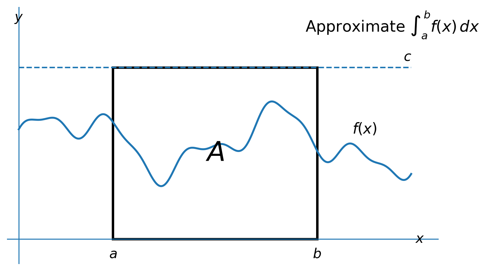

# Week 8 — S2 Warm-up: Inequalities, LLN/CLT, and Multivariate Normal

**Sources:**

- [Stat 110 source catalog](../sources/stat110/strategic-practice/)
- [Strategic Practice and Homework 10 — official PDF](https://stat110.hsites.harvard.edu/sites/g/files/omnuum10111/files/stat110/files/strategic_practice_and_homework_10.pdf)
- [Strategic Practice and Homework 11 — official PDF](https://stat110.hsites.harvard.edu/sites/g/files/omnuum10111/files/stat110/files/strategic_practice_and_homework_11.pdf)

---

## Strategic Practice 10 — Inequalities Problem 3

**Prompt.**
For i.i.d. r.v.s $X_1,\ldots,X_n$ with mean $\mu$ and variance $\sigma^2$, give a value of $n$ (as a specific number) that will ensure that there is at least a $99\%$ chance that the sample mean will be within $2$ standard deviations of the true mean $\mu$.

### My solution

Let

$$
\bar X_n=\frac{1}{n}\sum_{j=1}^n X_j.
$$

Since the $X_j$ are i.i.d. with variance $\sigma^2$,

$$
\begin{aligned}
\operatorname{Var}(\bar X_n)
&=\operatorname{Var}\left(\frac{1}{n}\sum_{j=1}^n X_j\right)\\
&=\frac{1}{n^2}\sum_{j=1}^n \operatorname{Var}(X_j)\\
&=\frac{1}{n^2}n\sigma^2\\
&=\frac{\sigma^2}{n}.
\end{aligned}
$$

Therefore,

$$
\operatorname{SD}(\bar X_n)=\frac{\sigma}{\sqrt n}.
$$

The problem asks for the sample mean to be within $2$ standard deviations of the true mean $\mu$. Here the standard deviation is the population standard deviation $\sigma$, so the target event is

$$
|\bar X_n-\mu|<2\sigma.
$$

By Chebyshev's inequality,

$$
P(|\bar X_n-\mu|\ge 2\sigma)
\le
\frac{\operatorname{Var}(\bar X_n)}{(2\sigma)^2}.
$$

Substituting $\operatorname{Var}(\bar X_n)=\sigma^2/n$,

$$
\begin{aligned}
P(|\bar X_n-\mu|\ge 2\sigma)
&\le
\frac{\sigma^2/n}{4\sigma^2}\\
&=\frac{1}{4n}.
\end{aligned}
$$

We want the outside probability to be at most $0.01$, so

$$
\frac{1}{4n}\le 0.01.
$$

Equivalently,

$$
4n\ge 100,
$$

so

$$
n\ge 25.
$$

Thus a specific value that works is

$$
\boxed{n=25.}
$$

### What I initially missed / corrected

The confusing point was the phrase "within $2$ standard deviations of the true mean." In this problem, that means within $2\sigma$, where $\sigma$ is the population standard deviation of each $X_j$.

It does not mean within $2$ standard errors of the sample mean. The standard error of $\bar X_n$ is

$$
\frac{\sigma}{\sqrt n}.
$$

So $2\sigma$ is equal to $2\sqrt n$ standard errors:

$$
2\sigma
=2\sqrt n\left(\frac{\sigma}{\sqrt n}\right).
$$

The event stays

$$
|\bar X_n-\mu|\ge 2\sigma.
$$

The $n$ enters through

$$
\operatorname{Var}(\bar X_n)=\frac{\sigma^2}{n},
$$

not by changing the event to use $2\sigma/\sqrt n$.

### Book's solution (for comparison)

Source status: verified. The user provided the book excerpt for this problem.

The book sets up the required probability as

$$
P(|\bar X_n-\mu|>2\sigma)\le 0.01.
$$

Then it applies Chebyshev's inequality to $Y=\bar X_n$ with $c=2\sigma$:

$$
P(|\bar X_n-\mu|>2\sigma)
\le
\frac{\operatorname{Var}(\bar X_n)}{(2\sigma)^2}.
$$

Since

$$
\operatorname{Var}(\bar X_n)=\frac{\sigma^2}{n},
$$

we get

$$
\frac{\operatorname{Var}(\bar X_n)}{(2\sigma)^2}
=
\frac{\sigma^2/n}{4\sigma^2}
=
\frac{1}{4n}.
$$

Therefore the desired inequality holds if

$$
\frac{1}{4n}\le 0.01,
$$

which gives

$$
\boxed{n\ge 25.}
$$

### Intuition

Averaging reduces variance. Each individual $X_j$ has standard deviation $\sigma$, but the sample mean has standard deviation

$$
\frac{\sigma}{\sqrt n}.
$$

The problem asks whether $\bar X_n$ lands within a fixed population-scale window around $\mu$, namely $2\sigma$. As $n$ grows, the sample mean gets more concentrated, so that fixed window becomes easier to hit.

Chebyshev gives a conservative guarantee:

$$
P(|\bar X_n-\mu|\ge 2\sigma)\le \frac{1}{4n}.
$$

To make the failure probability at most $1\%$, we need $n\ge 25$.

### Memory card (quick review)

- Population SD of each observation: $\sigma$.
- Standard error of the sample mean: $\sigma/\sqrt n$.
- The event in this problem is population-scale:

  $$
  |\bar X_n-\mu|\ge 2\sigma.
  $$

- Chebyshev applied to $\bar X_n$ gives:

  $$
  P(|\bar X_n-\mu|\ge 2\sigma)
  \le
  \frac{\sigma^2/n}{4\sigma^2}
  =
  \frac{1}{4n}.
  $$

- To get at least $99\%$ inside the window, require:

  $$
  \frac{1}{4n}\le 0.01,
  \qquad n\ge 25.
  $$

---

## Strategic Practice 11 — Law of Large Numbers / Central Limit Theorem Problem 5

**Prompt.**
Let $f$ be a complicated function whose integral $\int_a^b f(x)\,dx$ we want to approximate. Assume that $0\le f(x)\le c$. Let $A$ be the rectangle in the $(x,y)$-plane given by $a\le x\le b$ and $0\le y\le c$. Pick i.i.d. uniform points $(X_1,Y_1),(X_2,Y_2),\ldots,(X_n,Y_n)$ in the rectangle $A$.

How would you use these random points to approximate the integral? This is an example of a Monte Carlo method. Show that the estimate converges to the true value of the integral as $n\to\infty$.

Hint: look at whether each point is in the area below the curve $y=f(x)$.

### My solution

Let $I_j$ be an indicator r.v. such that

$$
I_j=
\begin{cases}
1, & \text{if point } j \text{ is below the curve},\\
0, & \text{otherwise}.
\end{cases}
$$

Then

$$
\mathbb{E}(I_j)=P(I_j=1).
$$

The probability that a uniformly sampled point lands below the curve is the ratio of the area below $f(x)$ to the area of the rectangle $A$. Therefore,

$$
P(I_j=1)
=
\frac{\text{area below } f(x)}{\text{area of rectangle } A}.
$$

Since the area below $f(x)$ from $a$ to $b$ is $\int_a^b f(x)\,dx$, and the rectangle has area $c(b-a)$,

$$
\mathbb{E}(I_j)
=
\frac{\int_a^b f(x)\,dx}{c(b-a)}.
$$

By the Law of Large Numbers, the empirical frequency of success converges to the true success probability:

$$
\frac{1}{n}\sum_{j=1}^n I_j
\to
\mathbb{E}(I_j)
$$

as $n\to\infty$. So,

$$
\frac{1}{n}\sum_{j=1}^n I_j
\to
\frac{\int_a^b f(x)\,dx}{c(b-a)}.
$$

Multiplying by the rectangle area gives the Monte Carlo estimate:

$$
\int_a^b f(x)\,dx
\approx
c(b-a)\frac{1}{n}\sum_{j=1}^n I_j.
$$

More precisely,

$$
c(b-a)\frac{1}{n}\sum_{j=1}^n I_j
\to
\int_a^b f(x)\,dx
$$

as $n\to\infty$.

### What I initially missed / corrected

The important correction is that the empirical average is not exactly equal to the expectation for finite $n$:

$$
\mathbb{E}(I_j)\ne \frac{1}{n}\sum_{j=1}^n I_j
$$

in general.

The correct statement is convergence by the Law of Large Numbers:

$$
\frac{1}{n}\sum_{j=1}^n I_j
\to
\mathbb{E}(I_j).
$$

So the final result should be written as an approximation for finite $n$, and as a convergence statement as $n\to\infty$.

### Book's solution (for comparison)

Source status: verified. The user provided the book excerpt for this problem.

The book defines the region under the curve as $B$, so the desired integral is the area of $B$. It then defines indicators $I_1,\ldots,I_n$, where each $I_j$ records whether the sampled point falls inside that region.

Let

$$
\mu=\mathbb{E}(I_1).
$$

Since the points are sampled uniformly from the rectangle $A$, the success probability is the area ratio

$$
\mu
=
\mathbb{E}(I_j)
=
P(I_j=1)
=
\frac{\int_a^b f(x)\,dx}{c(b-a)}.
$$

The book then estimates $\mu$ with the sample average of the indicators:

$$
\frac{1}{n}\sum_{j=1}^n I_j.
$$

Multiplying this estimated ratio by the rectangle area gives

$$
\int_a^b f(x)\,dx
\approx
c(b-a)\frac{1}{n}\sum_{j=1}^n I_j.
$$

Since the indicators are i.i.d. with mean $\mu$, the Law of Large Numbers says that this estimate converges to the true integral with probability $1$.

### Intuition

The sketch I used is:

The rectangle has area $c(b-a)$. If a fraction of the random points land below the curve, then that fraction estimates the fraction of the rectangle occupied by the area under $f(x)$.

So:

$$
\text{area under } f
\approx
\text{rectangle area}
\times
\text{fraction below the curve}.
$$

The indicator $I_j$ turns this geometric idea into a random variable. It records success or failure for point $j$, and the average

$$
\frac{1}{n}\sum_{j=1}^n I_j
$$

is exactly the observed fraction of points below the curve.

### Memory card (quick review)

- Define the success indicator:

  $$
  I_j=\mathbf{1}\{Y_j\le f(X_j)\}.
  $$

- Its expectation is the success probability:

  $$
  \mathbb{E}(I_j)=P(I_j=1).
  $$

- Since points are uniform in the rectangle:

  $$
  P(I_j=1)=\frac{\int_a^b f(x)\,dx}{c(b-a)}.
  $$

- By LLN:

  $$
  \frac{1}{n}\sum_{j=1}^n I_j
  \to
  \mathbb{E}(I_j).
  $$

- Therefore:

  $$
  c(b-a)\frac{1}{n}\sum_{j=1}^n I_j
  \to
  \int_a^b f(x)\,dx.
  $$

---

## Strategic Practice 11 — Multivariate Normal Problem 3

**Prompt.**
Let $(X,Y)$ be Bivariate Normal, with $X,Y\sim \mathcal{N}(0,1)$ marginally and correlation $\rho$, where $-1<\rho<1$. Find $a,b,c,d$ in terms of $\rho$ such that

$$
Z=aX+bY
$$

and

$$
W=cX+dY
$$

are independent $\mathcal{N}(0,1)$ random variables.

### My solution

From the prompt, $X$ and $Y$ are marginally $\mathcal{N}(0,1)$, so

$$
\mathbb{E}(X)=\mathbb{E}(Y)=0
$$

and

$$
\operatorname{Var}(X)=\operatorname{Var}(Y)=1.
$$

Also,

$$
\rho=\operatorname{Corr}(X,Y)
=
\frac{\operatorname{Cov}(X,Y)}
{\operatorname{SD}(X)\operatorname{SD}(Y)}.
$$

Since $\operatorname{SD}(X)=\operatorname{SD}(Y)=1$,

$$
\rho=\operatorname{Cov}(X,Y).
$$

And since both means are $0$,

$$
\operatorname{Cov}(X,Y)
=
\mathbb{E}(XY)-\mathbb{E}(X)\mathbb{E}(Y)
=
\mathbb{E}(XY).
$$

So

$$
\rho=\mathbb{E}(XY).
$$

Now let

$$
Z=aX+bY
$$

and

$$
W=cX+dY.
$$

We want $Z$ and $W$ to each have variance $1$.

First,

$$
\operatorname{Var}(Z)
=
\operatorname{Var}(aX+bY).
$$

Using covariance bilinearity,

$$
\begin{aligned}
\operatorname{Var}(Z)
&=\operatorname{Var}(aX)+\operatorname{Var}(bY)+2\operatorname{Cov}(aX,bY)\\
&=a^2\operatorname{Var}(X)+b^2\operatorname{Var}(Y)+2ab\operatorname{Cov}(X,Y)\\
&=a^2+b^2+2ab\rho.
\end{aligned}
$$

So the first condition is

$$
1=a^2+b^2+2ab\rho.
$$

Similarly,

$$
1=c^2+d^2+2cd\rho.
$$

To make $Z$ and $W$ independent, since $(Z,W)$ is a linear transformation of the bivariate normal vector $(X,Y)$, it is enough to make their covariance $0$.

So impose

$$
\operatorname{Cov}(Z,W)=0.
$$

Since the means are $0$,

$$
\operatorname{Cov}(Z,W)
=
\mathbb{E}(ZW).
$$

Then

$$
\mathbb{E}\left[(aX+bY)(cX+dY)\right]=0.
$$

Expanding,

$$
\mathbb{E}\left[acX^2+adXY+bcXY+bdY^2\right]=0.
$$

So

$$
ac\mathbb{E}(X^2)+ad\mathbb{E}(XY)+bc\mathbb{E}(XY)+bd\mathbb{E}(Y^2)=0.
$$

Using $\mathbb{E}(X^2)=1$, $\mathbb{E}(Y^2)=1$, and $\mathbb{E}(XY)=\rho$,

$$
ac+ad\rho+bc\rho+bd=0.
$$

Equivalently,

$$
ac+\rho(ad+bc)+bd=0.
$$

So the system is

$$
\begin{cases}
a^2+b^2+2ab\rho=1,\\
c^2+d^2+2cd\rho=1,\\
ac+\rho(ad+bc)+bd=0.
\end{cases}
$$

There are $3$ equations and $4$ unknowns, so there are many possible solutions. Choose something convenient:

$$
a=1,\qquad b=0.
$$

Then

$$
Z=X.
$$

The first equation becomes

$$
1^2+0^2+2(1)(0)\rho=1,
$$

which is true.

The third equation becomes

$$
1\cdot c+\rho(1\cdot d+0\cdot c)+0\cdot d=0,
$$

so

$$
c+\rho d=0.
$$

Therefore,

$$
c=-\rho d.
$$

Now replace this in the second equation:

$$
c^2+d^2+2cd\rho=1.
$$

Substituting $c=-\rho d$,

$$
(-\rho d)^2+d^2+2(-\rho d)(d)\rho=1.
$$

So

$$
\rho^2d^2+d^2-2\rho^2d^2=1.
$$

Thus

$$
d^2-\rho^2d^2=1.
$$

Factor:

$$
d^2(1-\rho^2)=1.
$$

Since $-1<\rho<1$, we have $1-\rho^2>0$, so choose

$$
d=\frac{1}{\sqrt{1-\rho^2}}.
$$

Then

$$
c=-\rho d
=
-\frac{\rho}{\sqrt{1-\rho^2}}.
$$

Therefore one valid choice is

$$
\boxed{
a=1,\qquad
b=0,\qquad
c=-\frac{\rho}{\sqrt{1-\rho^2}},\qquad
d=\frac{1}{\sqrt{1-\rho^2}}.
}
$$

With this choice,

$$
Z=X
$$

and

$$
W=\frac{Y-\rho X}{\sqrt{1-\rho^2}}.
$$

Since $Z$ and $W$ are jointly normal, have variance $1$, have mean $0$, and have covariance $0$, they are independent $\mathcal{N}(0,1)$ random variables.

### What I initially missed / corrected

The main thing to be careful about is the independence logic.

Independent random variables always have covariance $0$, but covariance $0$ does not usually imply independence. Here the reverse direction is valid because $(Z,W)$ is a linear transformation of the bivariate normal vector $(X,Y)$, so $(Z,W)$ is also multivariate normal.

Within the multivariate normal family,

$$
\operatorname{Cov}(Z,W)=0
\quad\Longrightarrow\quad
Z \text{ and } W \text{ are independent}.
$$

Another small correction is that at the start we only know $X,Y\sim\mathcal{N}(0,1)$ marginally. We do not know $Z,W\sim\mathcal{N}(0,1)$ until after choosing $a,b,c,d$ and checking the mean, variance, and covariance conditions.

### Book's solution (for comparison)

Source status: partial. The user provided the final excerpt of the book solution, verifying the coefficient choice below; the earlier derivation is not shown in the provided screenshot.

The book uses the same convenient choice:

$$
a=1,\qquad b=0.
$$

It then obtains

$$
d=\pm\frac{1}{\sqrt{1-\rho^2}}.
$$

Choosing the positive sign gives

$$
d=\frac{1}{\sqrt{1-\rho^2}},
$$

and then

$$
c=-\frac{\rho}{\sqrt{1-\rho^2}}.
$$

So the book's final choice is

$$
\boxed{
a=1,\qquad
b=0,\qquad
c=-\frac{\rho}{\sqrt{1-\rho^2}},\qquad
d=\frac{1}{\sqrt{1-\rho^2}}.
}
$$

This matches my result exactly. With these values,

$$
Z=X,
\qquad
W=\frac{Y-\rho X}{\sqrt{1-\rho^2}}.
$$

### Intuition

The variable $Y$ is correlated with $X$. The construction

$$
Y-\rho X
$$

removes the part of $Y$ that is linearly correlated with $X$.

After removing that correlated part, the remaining variable has variance $1-\rho^2$, so dividing by

$$
\sqrt{1-\rho^2}
$$

rescales it back to variance $1$.

So this problem is doing a two-step operation:

1. subtract the correlated part;
2. rescale the residual.

That is why the final independent standard normal is

$$
W=\frac{Y-\rho X}{\sqrt{1-\rho^2}}.
$$

### Memory card (quick review)

- If $X,Y\sim\mathcal{N}(0,1)$ marginally and $\operatorname{Corr}(X,Y)=\rho$, then

  $$
  \operatorname{Cov}(X,Y)=\rho.
  $$

- Try the convenient choice:

  $$
  Z=X.
  $$

- Remove the part of $Y$ correlated with $X$:

  $$
  Y-\rho X.
  $$

- Its variance is $1-\rho^2$, so standardize:

  $$
  W=\frac{Y-\rho X}{\sqrt{1-\rho^2}}.
  $$

- Within MVN, zero covariance implies independence.
