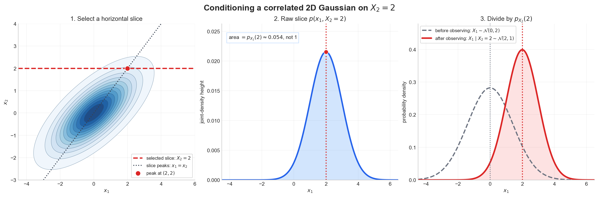

# Week 10 — Multivariate Gaussian Score and Conditioning

**Status:** Completed — Part I derives the multivariate Gaussian score and
Part II derives Gaussian conditioning, including a concrete 2D example.

**Source basis:** This is an independent derivation consolidated from my
handwritten work and the reviewed identities in
[`notes/w10_mml_multivariate_gaussian.md`](../notes/w10_mml_multivariate_gaussian.md).
I also consulted Appendix B of the
[CS229 probability review](https://cs229.stanford.edu/notes2022fall/cs229-probability_review.pdf)
for the conditioning argument. The relevant MML background reading is cataloged in
[`sources/mml/README.md`](../sources/mml/README.md). It is not presented as an
official or quoted source solution.

Vectors and scalar-function gradients are columns throughout.

---

## Part I — Multivariate Gaussian Score

### 1. Setup

Let

$$
x\sim\mathcal{N}(\mu,\Sigma),
$$

where $x,\mu\in\mathbb{R}^d$ and
$\Sigma\in\mathbb{R}^{d\times d}$ is symmetric positive definite. Its density
is

$$
p(x)
=
\frac{1}{(2\pi)^{d/2}|\Sigma|^{1/2}}
\exp\left(
-\frac12(x-\mu)^\top\Sigma^{-1}(x-\mu)
\right).
$$

The score is the gradient of the log-density with respect to the observation:

$$
s(x):=\nabla_x\log p(x).
$$

### 2. Derivation

Taking the logarithm gives

$$
\log p(x)
=
-\frac{d}{2}\log(2\pi)
-\frac12\log|\Sigma|
-\frac12(x-\mu)^\top\Sigma^{-1}(x-\mu).
$$

The first two terms are constant with respect to $x$. Therefore,

$$
\nabla_x\log p(x)
=
-\frac12\nabla_x\left[
(x-\mu)^\top\Sigma^{-1}(x-\mu)
\right].
$$

Define

$$
z=x-\mu.
$$

Because $\mu$ is constant, $dz/dx=I$. Using

$$
\nabla_z(z^\top A z)=(A+A^\top)z
$$

with $A=\Sigma^{-1}$ gives

$$
\nabla_x\log p(x)
=
-\frac12\left[
\Sigma^{-1}+(\Sigma^{-1})^\top
\right]z.
$$

Since $\Sigma$ is symmetric positive definite, its inverse is symmetric:

$$
(\Sigma^{-1})^\top=\Sigma^{-1}.
$$

Consequently,

$$
\begin{aligned}
\nabla_x\log p(x)
&=-\frac12(2\Sigma^{-1})z \\
&=-\Sigma^{-1}z.
\end{aligned}
$$

Replacing $z=x-\mu$ yields

$$
\boxed{
s(x)
=
\nabla_x\log p(x)
=
-\Sigma^{-1}(x-\mu)
}.
$$

### 3. Score versus density gradient

The score is not the gradient of the density itself. By the chain rule,

$$
\nabla_x\log p(x)
=
\frac{1}{p(x)}\nabla_xp(x).
$$

Therefore,

$$
\boxed{
\nabla_xp(x)
=
p(x)s(x)
=
-p(x)\Sigma^{-1}(x-\mu)
}.
$$

Expanding $p(x)$ gives

$$
\nabla_xp(x)
=
-\frac{\Sigma^{-1}(x-\mu)}
{(2\pi)^{d/2}|\Sigma|^{1/2}}
\exp\left(
-\frac12(x-\mu)^\top\Sigma^{-1}(x-\mu)
\right).
$$

---

## Concrete 2D Example

Let

$$
\mu=
\begin{bmatrix}
0\\
0
\end{bmatrix},
\qquad
\Sigma=
\begin{bmatrix}
2&1\\
1&1
\end{bmatrix}.
$$

The determinant is

$$
|\Sigma|=(2)(1)-(1)(1)=1,
$$

so

$$
\Sigma^{-1}
=
\frac{1}{|\Sigma|}
\begin{bmatrix}
1&-1\\
-1&2
\end{bmatrix}
=
\begin{bmatrix}
1&-1\\
-1&2
\end{bmatrix}.
$$

For a general point $x=(x_1,x_2)^\top$, the score is

$$
\begin{aligned}
s(x)
&=-
\begin{bmatrix}
1&-1\\
-1&2
\end{bmatrix}
\begin{bmatrix}
x_1\\
x_2
\end{bmatrix} \\
&=
\begin{bmatrix}
-x_1+x_2\\
x_1-2x_2
\end{bmatrix}.
\end{aligned}
$$

At the concrete point

$$
x=
\begin{bmatrix}
3\\
2
\end{bmatrix},
$$

we obtain

$$
\boxed{
s(3,2)
=
\begin{bmatrix}
-1\\
-1
\end{bmatrix}
}.
$$

Because the covariance is correlated, this vector does not point directly
toward the mean along the Euclidean displacement $(-3,-2)^\top$. Instead, it
points in the direction of fastest increase of the log-density under the
geometry defined by the covariance.

---

## Why Precision Controls the Pull

The precision matrix is

$$
\Lambda=\Sigma^{-1}.
$$

It transforms the displacement $x-\mu$ before the minus sign reverses the
direction:

$$
s(x)=-\Lambda(x-\mu).
$$

If

$$
\Sigma=QDQ^\top,
$$

then

$$
\Sigma^{-1}=QD^{-1}Q^\top.
$$

Thus, in each principal direction, the score scales the displacement by the
inverse variance. A low-variance direction has high precision and produces a
stronger pull for the same displacement. A high-variance direction has low
precision and produces a weaker pull.

The squared Mahalanobis distance is

$$
d_\Sigma^2(x,\mu)
=(x-\mu)^\top\Sigma^{-1}(x-\mu).
$$

It identifies points that are equally far from the mean in covariance-adjusted
units. The score is related to its gradient by

$$
s(x)
=
-\frac12\nabla_x d_\Sigma^2(x,\mu).
$$

Therefore, the score points toward decreasing Mahalanobis distance and
increasing log-density.

## Why the Score Is Normal to Density Contours

A density contour is a level set on which $p(x)$ is constant. Because the
logarithm is strictly increasing, $p(x)$ and $\log p(x)$ have the same level
sets. The gradient of a scalar function is perpendicular to its level sets, so

$$
s(x)=\nabla_x\log p(x)
$$

is normal to the Gaussian density contours.

For the numerical example, define

$$
q(x)=x^\top\Sigma^{-1}x.
$$

At $x=(3,2)^\top$,

$$
\nabla_xq(x)
=2\Sigma^{-1}x
=
\begin{bmatrix}
2\\
2
\end{bmatrix},
$$

while

$$
s(x)
=
-\frac12\nabla_xq(x)
=
\begin{bmatrix}
-1\\
-1
\end{bmatrix}.
$$

Both vectors are normal to the same contour, but the score chooses the direction
toward higher density.

---

## Part II — Conditional of a Joint Gaussian

### 1. Setup and shapes

Assume the **joint** random vector is Gaussian:

$$
\begin{bmatrix}
X_A\\
X_B
\end{bmatrix}
\sim
\mathcal{N}\left(
\begin{bmatrix}
\mu_A\\
\mu_B
\end{bmatrix},
\begin{bmatrix}
\Sigma_{AA} & \Sigma_{AB}\\
\Sigma_{BA} & \Sigma_{BB}
\end{bmatrix}
\right).
$$

Let $X_A\in\mathbb{R}^p$ and $X_B\in\mathbb{R}^q$. Then

$$
\begin{aligned}
\Sigma_{AA}&\in\mathbb{R}^{p\times p},
&\Sigma_{AB}&\in\mathbb{R}^{p\times q},\\
\Sigma_{BA}&\in\mathbb{R}^{q\times p},
&\Sigma_{BB}&\in\mathbb{R}^{q\times q}.
\end{aligned}
$$

Because the covariance matrix is symmetric positive definite,
$\Sigma_{BA}=\Sigma_{AB}^{\top}$ and $\Sigma_{BB}$ is invertible. We want the
distribution of $X_A$ after observing $X_B=x_B$.

Bayes' rule gives

$$
p(x_A\mid x_B)
=\frac{p(x_A,x_B)}{p_B(x_B)}.
$$

For fixed $x_B$, the denominator does not depend on $x_A$. Therefore, it is
enough to identify the terms in the joint density that depend on $x_A$.

### 2. Partition the precision matrix

Let

$$
V=\Sigma^{-1}
=
\begin{bmatrix}
V_{AA} & V_{AB}\\
V_{BA} & V_{BB}
\end{bmatrix}
$$

and define the Schur complement of $\Sigma_{BB}$ in $\Sigma$:

$$
S
=\Sigma_{AA}-\Sigma_{AB}\Sigma_{BB}^{-1}\Sigma_{BA}.
$$

Because $\Sigma$ is positive definite, $S$ is also positive definite and
therefore invertible.

The block-matrix inverse identity gives

$$
\begin{aligned}
V_{AA}
&=S^{-1},\\
V_{AB}
&=-S^{-1}\Sigma_{AB}\Sigma_{BB}^{-1},\\
V_{BA}
&=-\Sigma_{BB}^{-1}\Sigma_{BA}S^{-1},\\
V_{BB}
&=\Sigma_{BB}^{-1}
+\Sigma_{BB}^{-1}\Sigma_{BA}S^{-1}
  \Sigma_{AB}\Sigma_{BB}^{-1}.
\end{aligned}
$$

The corresponding shapes are

$$
V_{AA}\in\mathbb{R}^{p\times p},\qquad
V_{AB}\in\mathbb{R}^{p\times q},\qquad
V_{BA}\in\mathbb{R}^{q\times p},\qquad
V_{BB}\in\mathbb{R}^{q\times q}.
$$

Because $V$ is symmetric, $V_{BA}=V_{AB}^{\top}$.

### 3. Expand the quadratic form

Define the centered vectors

$$
z_A=x_A-\mu_A,
\qquad
z_B=x_B-\mu_B.
$$

Ignoring the joint Gaussian's normalization constant for the moment, its log
density is

$$
\log p(x_A,x_B)
=C-\frac12
\begin{bmatrix}
z_A\\
z_B
\end{bmatrix}^{\top}
\begin{bmatrix}
V_{AA} & V_{AB}\\
V_{BA} & V_{BB}
\end{bmatrix}
\begin{bmatrix}
z_A\\
z_B
\end{bmatrix}.
$$

Expanding the block product gives

$$
\log p(x_A,x_B)
=C-\frac12\left(
z_A^{\top}V_{AA}z_A
+z_A^{\top}V_{AB}z_B
+z_B^{\top}V_{BA}z_A
+z_B^{\top}V_{BB}z_B
\right).
$$

The two cross terms are equal scalars:

$$
z_B^{\top}V_{BA}z_A
=\left(z_A^{\top}V_{AB}z_B\right)^{\top}
=z_A^{\top}V_{AB}z_B.
$$

Hence

$$
\log p(x_A,x_B)
=C-\frac12\left(
z_A^{\top}V_{AA}z_A
+2z_A^{\top}V_{AB}z_B
+z_B^{\top}V_{BB}z_B
\right).
$$

> **Transcription correction.** In the handwritten four-term expansion, one
> cross term was missing its factor of $1/2$. Keeping the global
> $-\tfrac12$ outside the entire quadratic form makes the factors explicit.
> After the two equal cross terms are combined, their sum correctly becomes
> $2z_A^{\top}V_{AB}z_B$ inside the parentheses.

### 4. Hold the observation fixed

When conditioning on $X_B=x_B$, the vector $z_B$ is fixed. Therefore
$z_B^{\top}V_{BB}z_B$, the joint normalization constant, and $p_B(x_B)$ can
all be absorbed into a new constant $C(x_B)$ that may depend on $x_B$ but not
on $x_A$:

$$
\log p(x_A\mid x_B)
=C(x_B)-\frac12\left(
z_A^{\top}V_{AA}z_A
+2z_A^{\top}V_{AB}z_B
\right).
$$

### 5. Complete the square

Use the identity

$$
z^{\top}Az+2z^{\top}b
=
(z+A^{-1}b)^{\top}A(z+A^{-1}b)
-b^{\top}A^{-1}b.
$$

Here,

$$
z=z_A,
\qquad
A=V_{AA},
\qquad
b=V_{AB}z_B.
$$

The last term produced by completing the square depends on $z_B$ but not on
$z_A$, so it can also be absorbed into the constant. Thus

$$
\log p(x_A\mid x_B)
=C'(x_B)
-\frac12
\left(z_A+V_{AA}^{-1}V_{AB}z_B\right)^{\top}
V_{AA}
\left(z_A+V_{AA}^{-1}V_{AB}z_B\right).
$$

From the block-inverse identities,

$$
V_{AA}^{-1}=S
$$

and

$$
V_{AA}^{-1}V_{AB}
=S\left(-S^{-1}\Sigma_{AB}\Sigma_{BB}^{-1}\right)
=-\Sigma_{AB}\Sigma_{BB}^{-1}.
$$

Therefore,

$$
z_A+V_{AA}^{-1}V_{AB}z_B
=x_A-
\left[
\mu_A
+\Sigma_{AB}\Sigma_{BB}^{-1}(x_B-\mu_B)
\right].
$$

The final shape checks are

$$
\underbrace{\Sigma_{AB}}_{p\times q}
\underbrace{\Sigma_{BB}^{-1}}_{q\times q}
\underbrace{(x_B-\mu_B)}_{q\times 1}
\in\mathbb{R}^{p\times 1}
$$

and

$$
\underbrace{\Sigma_{AB}}_{p\times q}
\underbrace{\Sigma_{BB}^{-1}}_{q\times q}
\underbrace{\Sigma_{BA}}_{q\times p}
\in\mathbb{R}^{p\times p}.
$$

This is the quadratic form of a Gaussian whose conditional mean is

$$
\boxed{
\mu_{A\mid B}
=\mu_A
+\Sigma_{AB}\Sigma_{BB}^{-1}(x_B-\mu_B)
}
$$

and whose conditional covariance is

$$
\boxed{
\Sigma_{A\mid B}
=V_{AA}^{-1}
=S
=\Sigma_{AA}
-\Sigma_{AB}\Sigma_{BB}^{-1}\Sigma_{BA}
}.
$$

Hence

$$
\boxed{
X_A\mid X_B=x_B
\sim
\mathcal{N}\left(
\mu_A+\Sigma_{AB}\Sigma_{BB}^{-1}(x_B-\mu_B),
\Sigma_{AA}-\Sigma_{AB}\Sigma_{BB}^{-1}\Sigma_{BA}
\right)
}.
$$

### 6. Why only the conditional mean depends on the observation

The conditional mean contains the residual $x_B-\mu_B$, so changing the
observed value moves the center of the conditional Gaussian. The conditional
covariance contains only blocks of the original covariance matrix. It measures
the uncertainty remaining in $X_A$ after $X_B$ is known, so its value does not
depend on which particular $x_B$ was observed.

### 7. Concrete 2D example

Reuse the same Gaussian as in Part I:

$$
\mu=
\begin{bmatrix}
0\\
0
\end{bmatrix},
\qquad
\Sigma=
\begin{bmatrix}
2 & 1\\
1 & 1
\end{bmatrix}.
$$

Take $X_A=X_1$, $X_B=X_2$, and condition on $X_2=2$. This reuses the observed
second coordinate of the point $x=(3,2)^{\top}$ from the score example.

Because $X_A$ and $X_B$ are both scalar, every covariance block has shape
$1\times1$:

$$
\mu_A=\mu_B=0,
\qquad
\Sigma_{AA}=2,
\qquad
\Sigma_{AB}=\Sigma_{BA}=1,
\qquad
\Sigma_{BB}=1.
$$

The conditional mean is

$$
\begin{aligned}
\mu_{A\mid B}
&=\mu_A+\Sigma_{AB}\Sigma_{BB}^{-1}(x_B-\mu_B)\\
&=0+(1)(1^{-1})(2-0)\\
&=2.
\end{aligned}
$$

The conditional covariance is

$$
\begin{aligned}
\Sigma_{A\mid B}
&=\Sigma_{AA}-\Sigma_{AB}\Sigma_{BB}^{-1}\Sigma_{BA}\\
&=2-(1)(1^{-1})(1)\\
&=1.
\end{aligned}
$$

Therefore,

$$
\boxed{
X_1\mid X_2=2\sim\mathcal{N}(2,1)
}.
$$

Here the second parameter is the variance, so the conditional standard
deviation is also $1$.

#### Geometric check: conditioning is a normalized slice

The positive covariance tilts the joint-density contours upward: large values
of $X_2$ tend to accompany large values of $X_1$. Fixing $X_2=2$ selects the
horizontal slice $p_{X_1,X_2}(x_1,2)$. Along that slice, the joint density
reaches its maximum at $x_1=2$, agreeing with the conditional mean.

The raw slice is not yet a probability density over $x_1$, because its area is
$p_{X_2}(2)$ rather than $1$. Conditioning normalizes it:

$$
\int_{-\infty}^{\infty}p_{X_1,X_2}(x_1,2)\,dx_1
=p_{X_2}(2),
$$

and therefore

$$
p_{X_1\mid X_2}(x_1\mid2)
=\frac{p_{X_1,X_2}(x_1,2)}{p_{X_2}(2)}.
$$

For this example, $X_2\sim\mathcal{N}(0,1)$, so

$$
p_{X_2}(2)
=\frac{1}{\sqrt{2\pi}}e^{-2}
\approx0.054.
$$

After normalization, the slice becomes the conditional density
$\mathcal{N}(2,1)$. Compared with the marginal
$X_1\sim\mathcal{N}(0,2)$, observing $X_2=2$ shifts the mean from $0$ to $2$
and reduces the variance from $2$ to $1$.

*The first panel selects the slice, the second shows that its unnormalized area
is $p_{X_2}(2)$, and the third shows the normalized conditional distribution
beside the original marginal distribution of $X_1$.*

The [solved Week 10 notebook](../notebooks/w10_mv_gaussian_score_solved.ipynb)
provides the complementary empirical check using samples.
