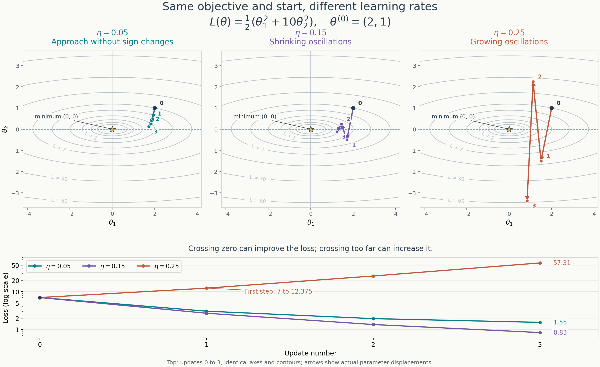

# Week 13 — Optimizer Update Derivations

**Status:** Partial weekly write-up — Session 2 gradient-descent calculations,
recurrences, and step-size checkpoint reviewed on 2026-10-06.
Session 3 momentum calculations and conceptual checkpoints reviewed on
2026-10-07.

**Source basis:** The handwritten Session 2 and Session 3 pages supplied for
review, together with the conceptual discussion.
The calculations below are independently checked derivations for our practice
objective, not the book's worked example or an official solution.
Reading context: MML §§7.1.1–7.1.2; see the
[MML source catalog](../sources/mml/README.md) and the
[official book](https://mml-book.github.io/book/mml-book.pdf).
The geometry and gradient convention are in the
[Week 13 optimization note](../notes/w13_optimization.md).

## 1. Gradient Descent on the Practice Quadratic

### Objective, Notation, and Update Rule

The parameter vector is a column vector, and

$$
L(\theta)=\frac12(\theta_1^2+10\theta_2^2),
\qquad
\nabla_\theta L(\theta)=A\theta,
\qquad
A=\begin{bmatrix}1&0\\0&10\end{bmatrix}.
$$

I use $\theta^{(k)}$ for the full vector at iteration $k$, and
$\theta_1^{(k)}$, $\theta_2^{(k)}$ for its coordinates. This distinguishes
the first coordinate from the vector after the first update.

With a constant learning rate $\eta$, gradient descent is

$$
\theta^{(k+1)}
=\theta^{(k)}-\eta\nabla_\theta L\bigl(\theta^{(k)}\bigr).
$$

The gradient is evaluated at the current parameters on every iteration.
MML uses $\gamma$ for the learning rate; here I use $\eta$.

### First Two Updates with $\eta=0.05$

Start at

$$
\theta^{(0)}=\begin{bmatrix}2\\1\end{bmatrix},
\qquad
\nabla_\theta L\bigl(\theta^{(0)}\bigr)
=\begin{bmatrix}2\\10\end{bmatrix}.
$$

The first update is

$$
\begin{aligned}
\theta^{(1)}
&=\begin{bmatrix}2\\1\end{bmatrix}
-0.05\begin{bmatrix}2\\10\end{bmatrix}\\
&=\begin{bmatrix}2\\1\end{bmatrix}
-\begin{bmatrix}0.1\\0.5\end{bmatrix}\\
&=\begin{bmatrix}1.9\\0.5\end{bmatrix}.
\end{aligned}
$$

Recompute the gradient at this new point:

$$
\nabla_\theta L\bigl(\theta^{(1)}\bigr)
=\begin{bmatrix}1.9\\10(0.5)\end{bmatrix}
=\begin{bmatrix}1.9\\5\end{bmatrix}.
$$

The second update is therefore

$$
\begin{aligned}
\theta^{(2)}
&=\begin{bmatrix}1.9\\0.5\end{bmatrix}
-0.05\begin{bmatrix}1.9\\5\end{bmatrix}\\
&=\begin{bmatrix}1.9\\0.5\end{bmatrix}
-\begin{bmatrix}0.095\\0.25\end{bmatrix}\\
&=\begin{bmatrix}1.805\\0.25\end{bmatrix}.
\end{aligned}
$$

Both final handwritten updates are correct. In particular, the corrected
second update uses $10\theta_2^{(1)}=5$ as the second gradient component.

### Coordinate Recurrences

Substituting the gradient into the update gives

$$
\theta^{(k+1)}=(I-\eta A)\theta^{(k)},
\qquad
I-\eta A=
\begin{bmatrix}1-\eta&0\\0&1-10\eta\end{bmatrix}.
$$

Thus the two coordinate recurrences are

$$
\begin{aligned}
\theta_1^{(k+1)}
&=\theta_1^{(k)}-\eta\theta_1^{(k)}
=(1-\eta)\theta_1^{(k)},\\
\theta_2^{(k+1)}
&=\theta_2^{(k)}-10\eta\theta_2^{(k)}
=(1-10\eta)\theta_2^{(k)}.
\end{aligned}
$$

Repeated substitution, starting from $(2,1)^\top$, yields

$$
\theta_1^{(k)}=2(1-\eta)^k,
\qquad
\theta_2^{(k)}=(1-10\eta)^k.
$$

These geometric sequences explain the learning-rate predictions. A
multiplier with absolute value below $1$ shrinks the coordinate toward
zero. A negative multiplier also flips its sign at every step. A multiplier
with absolute value above $1$ makes a nonzero coordinate grow in magnitude.

### Predictions for the Three Learning Rates

| Learning rate $\eta$ | $\theta_1$ multiplier | $\theta_2$ multiplier | Behavior from $(2,1)^\top$ |
| --- | --- | --- | --- |
| $0.05$ | $0.95$ | $0.5$ | Both coordinates approach zero without sign changes. |
| $0.15$ | $0.85$ | $-0.5$ | Both coordinates approach zero; $\theta_2$ alternates sign with decreasing magnitude. |
| $0.25$ | $0.75$ | $-1.5$ | $\theta_1$ approaches zero, while $\theta_2$ alternates sign with increasing magnitude; the parameters and loss diverge. |

The handwritten predictions are correct. The sign changes in $\theta_2$
cross the line $\theta_2=0$, which is the horizontal axis in the contour
plot. Oscillation alone does not imply divergence: its amplitude decreases
for $\eta=0.15$ and increases for $\eta=0.25$.

### Visual Comparison of the First Three Updates

All three contour panels use the same axes, loss contours, starting point,
and three-update budget. Point $0$ is the initial vector; points $1$–$3$
are the successive updates. The arrows show the actual parameter
displacements.

Both $\eta=0.15$ and $\eta=0.25$ cross $\theta_2=0$. The middle trajectory
alternates with shrinking amplitude; the right trajectory alternates with
growing amplitude. The loss plot below uses a logarithmic vertical scale
and shows the corresponding decrease or increase in the objective.

### Learning-Rate Range from the Recurrences

An independent extension of the recurrences gives the range that makes both
coordinates converge to zero from our nonzero starting coordinates:

$$
\begin{aligned}
|1-\eta|<1 &\quad\Longleftrightarrow\quad 0<\eta<2,\\
|1-10\eta|<1 &\quad\Longleftrightarrow\quad 0<\eta<0.2.
\end{aligned}
$$

Both conditions must hold, so their intersection is

$$
\boxed{0<\eta<0.2}.
$$

The direction with greater curvature imposes the tighter restriction. At
$\eta=0.2$, the second-coordinate multiplier is $-1$: that coordinate
alternates sign without shrinking, so the strict upper bound matters.

### Why a Negative-Gradient Step Can Increase the Loss

The gradient describes the local slope at the starting point. A sufficiently
small move in its negative direction decreases the loss. A large move can
overshoot the minimum in a coordinate and land farther from it.

For $\eta=0.25$, the first update is

$$
\theta^{(1)}
=\begin{bmatrix}2\\1\end{bmatrix}
-0.25\begin{bmatrix}2\\10\end{bmatrix}
=\begin{bmatrix}1.5\\-1.5\end{bmatrix}.
$$

The second coordinate crosses zero and increases in magnitude from $1$ to
$1.5$. Its contribution to the loss therefore grows:

| Loss contribution | Before the update | After the update |
| --- | --- | --- |
| $\theta_1^2/2$ | $2$ | $1.125$ |
| $5\theta_2^2$ | $5$ | $11.25$ |
| Total loss | $7$ | $12.375$ |

The increase in the second contribution outweighs the decrease in the first.
We followed the negative gradient at the starting point, but the step was
too large to reduce the final loss.

Crossing zero alone does not imply an increase. With $\eta=0.15$, the first
update is $(1.7,-0.5)^\top$: the second coordinate also changes sign, but
both coordinates end closer to zero and the loss decreases to $2.695$.
The important distinction is how far the step lands beyond the minimum.

### Session 2 Review Checkpoints

- [x] Calculate the first two gradient-descent updates with $\eta=0.05$.
- [x] Recompute the gradient at the current parameter vector.
- [x] Derive the two coordinate recurrences and explain the learning-rate predictions.
- [x] Explain why a sufficiently large step in the negative-gradient direction can increase the loss.

## 2. Gradient Descent with Momentum

### Convention and Initialization

I use the same column gradient and objective as before:

$$
g^{(k)}=\nabla_\theta L\bigl(\theta^{(k)}\bigr)
=A\theta^{(k)},
\qquad A=\begin{bmatrix}1&0\\0&10\end{bmatrix}.
$$

The state $\Delta^{(k)}$ stores the previous parameter displacement. In this
convention, the next displacement is computed before updating the parameters:

$$
\begin{aligned}
\Delta^{(k+1)}&=\alpha\Delta^{(k)}-\eta g^{(k)},\\
\theta^{(k+1)}&=\theta^{(k)}+\Delta^{(k+1)}.
\end{aligned}
$$

This is MML's displacement convention, equations 7.11–7.12 on printed
page 231, expressed using our column gradients and iteration notation.

The starting point, initial state, and constant hyperparameters are

$$
\theta^{(0)}=\begin{bmatrix}2\\1\end{bmatrix},
\qquad
\Delta^{(0)}=\begin{bmatrix}0\\0\end{bmatrix},
\qquad
\eta=0.05,
\qquad
\alpha=0.9.
$$

The [comparison with Andrew Ng's convention](../notes/w13_optimization.md#comparing-mml-with-andrew-ngs-momentum-convention)
derives the learning-rate rescaling needed when the state instead stores
an exponential moving average of gradients. The calculations below retain
the displacement convention and hyperparameters defined here.

### First Two Updates by Hand

At the starting point, $g^{(0)}=(2,10)^\top$. Zero initial memory gives

$$
\begin{aligned}
\Delta^{(1)}
&=0.9\begin{bmatrix}0\\0\end{bmatrix}
-0.05\begin{bmatrix}2\\10\end{bmatrix}
=\begin{bmatrix}-0.1\\-0.5\end{bmatrix},\\
\theta^{(1)}
&=\begin{bmatrix}2\\1\end{bmatrix}
+\begin{bmatrix}-0.1\\-0.5\end{bmatrix}
=\begin{bmatrix}1.9\\0.5\end{bmatrix}.
\end{aligned}
$$

The new gradient is $g^{(1)}=(1.9,5)^\top$. The second displacement retains
part of the first and adds the current negative-gradient contribution:

$$
\begin{aligned}
\Delta^{(2)}
&=0.9\begin{bmatrix}-0.1\\-0.5\end{bmatrix}
-0.05\begin{bmatrix}1.9\\5\end{bmatrix}\\
&=\begin{bmatrix}-0.09\\-0.45\end{bmatrix}
+\begin{bmatrix}-0.095\\-0.25\end{bmatrix}\\
&=\begin{bmatrix}-0.185\\-0.7\end{bmatrix},\\
\theta^{(2)}
&=\begin{bmatrix}1.9\\0.5\end{bmatrix}
+\begin{bmatrix}-0.185\\-0.7\end{bmatrix}
=\begin{bmatrix}1.715\\-0.2\end{bmatrix}.
\end{aligned}
$$

### Consolidated Handwritten Table

The first two rows provide the requested two updates. The third row
preserves the additional handwritten calculation, also checked with exact
arithmetic.

| Iteration $k$ | Current $\theta^{(k)}$ | Gradient $g^{(k)}$ | New displacement $\Delta^{(k+1)}$ | Next $\theta^{(k+1)}$ |
| --- | --- | --- | --- | --- |
| $0$ | $(2,1)^\top$ | $(2,10)^\top$ | $(-0.1,-0.5)^\top$ | $(1.9,0.5)^\top$ |
| $1$ | $(1.9,0.5)^\top$ | $(1.9,5)^\top$ | $(-0.185,-0.7)^\top$ | $(1.715,-0.2)^\top$ |
| $2$ | $(1.715,-0.2)^\top$ | $(1.715,-2)^\top$ | $(-0.25225,-0.53)^\top$ | $(1.46275,-0.73)^\top$ |

### Comparison with Plain Gradient Descent

Both methods use the same starting point and learning rate $\eta=0.05$.

| Update number | Plain gradient descent | Momentum with $\alpha=0.9$ |
| --- | --- | --- |
| $1$ | $(1.9,0.5)^\top$ | $(1.9,0.5)^\top$ |
| $2$ | $(1.805,0.25)^\top$ | $(1.715,-0.2)^\top$ |

The first updates agree because the momentum state starts at zero. At the
second update, both methods evaluate the same gradient at $(1.9,0.5)^\top$.
Momentum additionally carries forward $0.9\Delta^{(1)}=(-0.09,-0.45)^\top$.

The [visual comparison in the optimization notes](../notes/w13_optimization.md#visual-comparison-with-plain-gradient-descent)
plots the first three updates with identical contours and coordinate scales.
It also extends both calculations to 120 updates, showing the temporary
loss increase and subsequent decay of momentum's oscillations.

### What Momentum Remembers

The state stores the previous displacement, scaled by $\alpha$ before it
is carried into the next update. That displacement already contains earlier
contributions, so the memory extends beyond a single gradient. With zero
initial state and constant $\eta$, unrolling the recurrence gives

$$
\Delta^{(k+1)}
=-\eta\sum_{j=0}^{k}\alpha^{k-j}g^{(j)}.
$$

Older gradient contributions receive progressively smaller weights when
$0\leq\alpha<1$. The state, gradient, and parameter vector remain distinct
quantities.

In the second handwritten update, the remembered displacement
$(-0.09,-0.45)^\top$ and the current contribution
$(-0.095,-0.25)^\top$ have matching signs in both coordinates. They reinforce
each other, giving a larger displacement than plain gradient descent.

### Agreeing and Alternating Gradients in a Narrow Valley

Along a valley, consistently directed contributions can accumulate,
building sustained motion toward lower loss. Across the valley, alternating
contributions can partially cancel against the remembered motion and damp
rapid zigzagging.

This explains why momentum can help with a narrow valley. The smoothing
comes from combining signed contributions over time. The gradient's sign
still comes from the current position on the loss surface; momentum does
not directly hold that sign fixed. Retained motion can delay a reversal,
and accumulation can also make individual steps larger.

### The Third Update: Memory Can Dominate Current Descent

The additional handwritten row makes this effect visible. At
$\theta^{(2)}=(1.715,-0.2)^\top$, the second gradient component is $-2$.
For that coordinate, the next displacement is

$$
\Delta_2^{(3)}
=0.9(-0.7)-0.05(-2)
=-0.63+0.1
=-0.53.
$$

The current negative-gradient contribution is positive, pointing toward
zero from $-0.2$. The retained displacement is negative and larger in
magnitude, so the combined update moves the coordinate to $-0.73$, farther
from zero. The total loss also increases:

$$
L(\theta^{(2)})=1.6706125,
\qquad
L(\theta^{(3)})=3.73431878125.
$$

This is why momentum still needs a suitable learning rate. The learning
rate controls fresh contributions and, through earlier updates, the stored
motion. The coefficient $\alpha$ controls how much of that motion persists;
the two hyperparameters must be considered together.

### Independent Diagnostic: Overshoot Versus Divergence

A single loss increase does not establish divergence. For this particular
quadratic, an independent check confirms that $\eta=0.05$, $\alpha=0.9$
still produces eventual convergence, despite the early overshoot.

For $k\geq1$, eliminating the displacement state gives the coordinate
recurrence with curvature $a\in\{1,10\}$:

$$
\theta_j^{(k+1)}
=(1+\alpha-\eta a)\theta_j^{(k)}-\alpha\theta_j^{(k-1)}.
$$

Its characteristic equation is

$$
r^2-(1+\alpha-\eta a)r+\alpha=0.
$$

For both curvatures, the chosen hyperparameters give complex roots with
magnitude $\sqrt{0.9}\approx0.9487<1$. Their modes therefore decay toward
zero. This diagnostic separates temporary overshoot from the divergence
seen in plain GD with $\eta=0.25$; it is an independent extension of the
handwritten work.

### Session 3 Review Checkpoints

- [x] Write down the momentum convention, initial state, and hyperparameters.
- [x] Calculate the first two updates and compare them with plain gradient descent.
- [x] Explain what momentum remembers and what happens when successive gradients agree.
- [x] Explain how alternating gradients relate to motion in a narrow valley.
- [x] Explain why momentum still needs a suitable learning rate.
